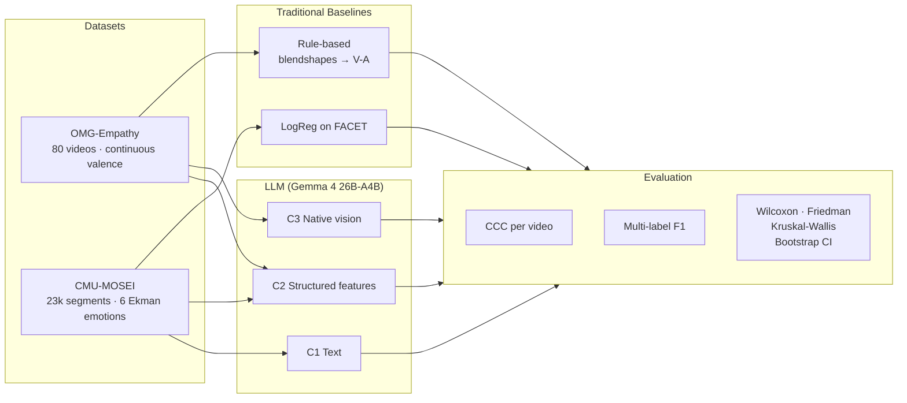
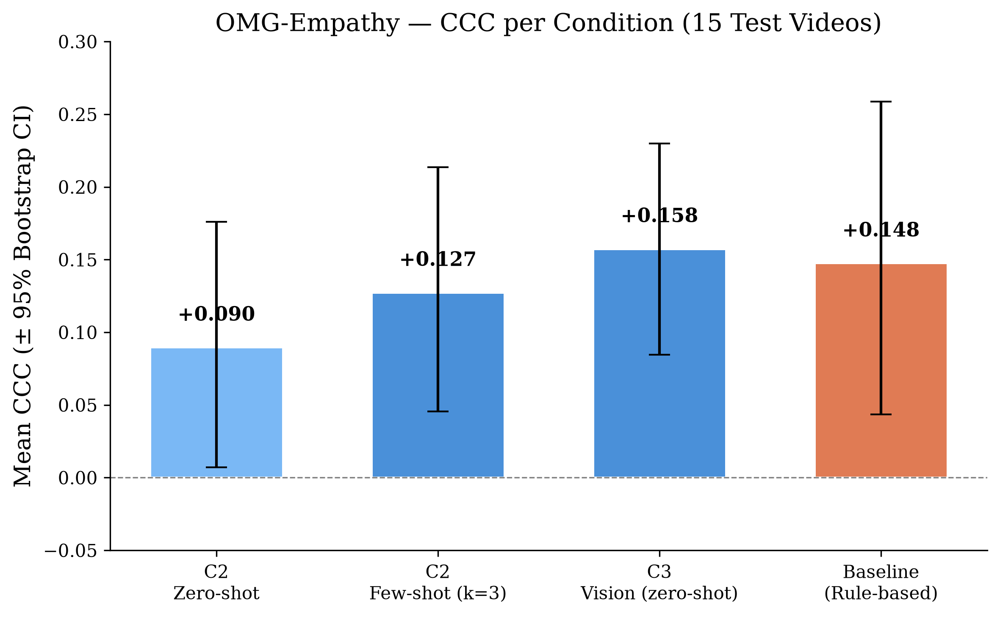
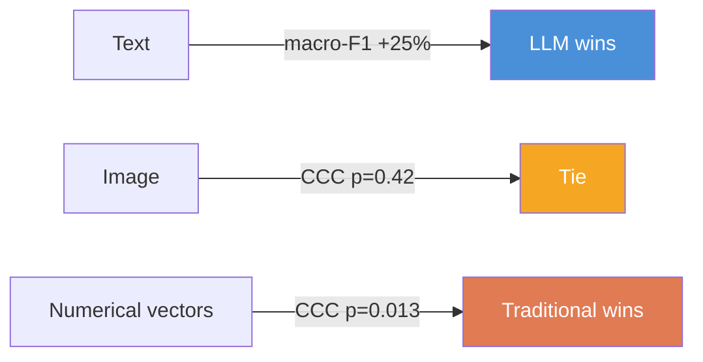

# PaperAdvanRobot

**LLM Multimodal vs. Traditional Methods for Emotion Recognition — Experimental Pipeline**

> Reproducible pipeline comparing a **rule-based blendshape engine** and a
> **logistic regression on FACET features** against a **multimodal LLM
> (Gemma 4 26B)** on two affective computing benchmarks.

---

## Overview



---

## Key Results

### OMG-Empathy — Continuous Valence (CCC)

| System | Mean CCC | 95% Bootstrap CI |
|---|---|---|
| **LLM C3 (vision) — zero-shot** | **+0.158** | [+0.085, +0.230] |
| Baseline (rule-based) | +0.148 | [+0.044, +0.259] |
| LLM C2 (blendshapes) — few-shot k=3 | +0.127 | [+0.046, +0.213] |
| LLM C2 (blendshapes) — zero-shot | +0.090 | [+0.007, +0.176] |

**Friedman test**: χ² = 10.04, p = 0.018 (significant omnibus difference).



### CMU-MOSEI — Multi-Label Emotion (F1)

| System | F1 micro | **F1 macro** | F1 weighted |
|---|---|---|---|
| Baseline (LogReg on FACET) | 0.376 | 0.333 | 0.423 |
| **LLM C1 (text) — few-shot k=5** | **0.499** | **0.416** | 0.498 |
| LLM C2 (FACET) — few-shot k=5 | 0.289 | 0.130 | 0.213 |

**Kruskal-Wallis**: H = 29.18, p < 10⁻⁵ (significant across 4 systems).


### Modality-Dependent Advantage



> **Central finding:** the LLM's advantage is not universal — it depends on the
> input representation. Text → LLM. Image → tie. Serialized numerical features → traditional.

---

## Tech Stack

| Component | Technology |
|---|---|
| LLM Model | Gemma 4 26B-A4B-it (MoE, 3.8B active/token) |
| Quantization | AWQ 4-bit (weight-only) |
| Serving | vLLM (OpenAI-compatible API, PagedAttention) |
| GPU | NVIDIA L4 24 GB (GCP Spot VM) |
| Orchestration | LangGraph + LangChain |
| Facial features (OMG) | MediaPipe Face Landmarker (52 blendshapes) |
| Visual features (MOSEI) | FACET 35-dim (pre-extracted) |
| Evaluation | CCC, multi-label F1, Wilcoxon, Friedman, Kruskal-Wallis, Bootstrap CI, Cohen's d |

---

## Prerequisites

- **Python 3.11** (MediaPipe requires ≤ 3.12)
- **GPU**: NVIDIA L4 24 GB (or equivalent with ≥ 24 GB VRAM) for vLLM serving
- **vLLM** running with the Gemma 4 model (see [Model Setup](#model-setup))

## Installation

```bash
git clone https://github.com/THIAGONOMA/PaperAdvanRobot.git
cd PaperAdvanRobot

python3.11 -m venv .venv
source .venv/bin/activate
pip install -r requirements.txt
```

## Data Setup

### OMG-Empathy

Download the OMG-Empathy dataset and extract to `data/`:

```bash
# Download (password-protected zip — see paper for details)
unzip -P 'M2ComZJChbPc' OMG_Empathy2019_full_fY4m3eyn.zip -d data/
```

Expected structure:
```
data/OMG_Empathy2019_full_fY4m3eyn/
├── TestVideos/         # MP4 videos (split-screen)
├── Annotations/        # CSV with continuous valence per frame
└── ...
```

### CMU-MOSEI

Download from [Kaggle](https://www.kaggle.com/datasets/samarwarsi/cmu-mosei/data):

```bash
pip install kaggle
kaggle datasets download -d samarwarsi/cmu-mosei -f CMU_MOSEI_TimestampedWords.csd -p data/
kaggle datasets download -d samarwarsi/cmu-mosei -f CMU_MOSEI_VisualFacet42.csd -p data/
kaggle datasets download -d samarwarsi/cmu-mosei -f CMU_MOSEI_Labels.csd -p data/
```

Expected structure:
```
data/
├── CMU_MOSEI_TimestampedWords.csd   # Transcripts (HDF5)
├── CMU_MOSEI_VisualFacet42.csd      # FACET features (HDF5)
└── CMU_MOSEI_Labels.csd             # Emotion labels (HDF5)
```

## Model Setup

Start vLLM with the quantized Gemma 4 model:

```bash
vllm serve cyankiwi/gemma-4-26B-A4B-it-AWQ-4bit \
    --port 8000 \
    --max-model-len 8192 \
    --gpu-memory-utilization 0.95
```

Configure the endpoint in `config/config.yaml`:

```yaml
llm:
  base_url: "http://localhost:8000/v1"
  model: "cyankiwi/gemma-4-26B-A4B-it-AWQ-4bit"
```

Or via environment variables:

```bash
export LLM_BASE_URL="http://localhost:8000/v1"
export LLM_MODEL="cyankiwi/gemma-4-26B-A4B-it-AWQ-4bit"
```

---

## Running Experiments

All scripts use `PYTHONPATH=.` to resolve the `src/` package.

### OMG-Empathy Evaluation

```bash
# C3 — Native vision (3 JPEG keyframes per 4s window), zero-shot
PYTHONPATH=. python scripts/eval_omg_timeseries.py --condition C3

# C2 — Blendshape features, few-shot k=3
PYTHONPATH=. python scripts/eval_omg_timeseries.py --condition C2 --k-shots 3

# C2 — Blendshape features, zero-shot
PYTHONPATH=. python scripts/eval_omg_timeseries.py --condition C2
```

### CMU-MOSEI Evaluation

```bash
# Runs all conditions (C1 text, C2 FACET, zero-shot and few-shot)
PYTHONPATH=. python scripts/eval_mosei_multilabel.py
```

### Generate Figures and Statistical Tests

```bash
# Generates all plots + stats_report.txt
PYTHONPATH=. python scripts/generate_summary_assets.py

# Generates cost analysis + latency boxplot
PYTHONPATH=. python scripts/compute_cost_report.py
```

Output:
- `results/figures/*.png` — Publication-quality figures (DPI 300, serif font)
- `results/stats_report.txt` — Full statistical report (14 tests)
- `results/cost_report.txt` — Computational cost breakdown

---

## Experimental Conditions

| Condition | Input to LLM | Dataset | Description |
|---|---|---|---|
| **C1** | Verbatim transcript | MOSEI | Speaker's words as text |
| **C2** | Serialized facial features | OMG + MOSEI | Blendshape stats (OMG) or FACET coefficients (MOSEI) |
| **C3** | JPEG keyframes | OMG | 3 frames per 4s window via vision encoder |

> MOSEI does not provide raw video — only pre-extracted features.
> Hence C3 is restricted to OMG and MOSEI C2 uses FACET as proxy.

---

## Statistical Tests

The pipeline implements 14 statistical tests/metrics:

| Test | Purpose | Dataset |
|---|---|---|
| Wilcoxon signed-rank | Pairwise paired comparisons | OMG (5 pairs), MOSEI (C1 vs C2) |
| Friedman test | Non-parametric repeated-measures ANOVA | OMG (4 conditions × 15 videos) |
| Kruskal-Wallis | Non-parametric one-way ANOVA | MOSEI (4 systems), Latency (4 conditions) |
| Dunn post-hoc | Pairwise comparisons after omnibus | MOSEI, Latency |
| Holm-Bonferroni | Multiple comparisons correction | OMG post-hoc |
| Bootstrap 95% CI | Confidence intervals (10,000 resamples) | OMG CCC, MOSEI F1, Per-emotion F1 |
| Cohen's d | Effect size | OMG, MOSEI |
| McNemar's test | Exact label-set match | MOSEI (C1 vs C2) |

---

## Repository Structure

```
PaperAdvanRobot/
├── config/
│   └── config.yaml                  # Centralized configuration
├── src/
│   ├── config.py                    # Config loader (Pydantic)
│   ├── data/
│   │   ├── omg_loader.py            # OMG-Empathy loader (video + valence)
│   │   ├── mosei_loader.py          # CMU-MOSEI loader (HDF5 .csd)
│   │   └── types.py                 # Sample, GroundTruth data types
│   ├── features/
│   │   ├── blendshapes.py           # MediaPipe Face Landmarker (52 blendshapes)
│   │   ├── extract.py               # Multi-frame feature extraction
│   │   └── serialize.py             # Feature serialization for prompts
│   ├── baseline/
│   │   └── rule_engine.py           # Rule-based blendshapes → valence-arousal
│   ├── llm/
│   │   ├── schema.py                # Pydantic: ValencePrediction, EmotionPrediction
│   │   ├── prompts.py               # Calibrated system/user prompts
│   │   ├── graph.py                 # LangGraph: inference state machine
│   │   ├── runner.py                # Batch inference executor
│   │   └── fewshot.py               # Few-shot example generation
│   └── eval/
│       ├── metrics.py               # CCC, F1, CCC per video
│       └── stats.py                 # McNemar, bootstrap CI
├── scripts/
│   ├── eval_omg_timeseries.py       # OMG evaluation (official CCC protocol)
│   ├── eval_mosei_multilabel.py     # MOSEI evaluation (multi-label F1)
│   ├── generate_summary_assets.py   # Figures + statistical tests
│   └── compute_cost_report.py       # Computational cost analysis
├── results/
│   ├── figures/                     # Generated plots (PNG)
│   ├── stats_report.txt             # Full statistical report
│   ├── cost_report.txt              # Cost and latency analysis
│   └── *.parquet                    # Raw evaluation data
├── docs/
│   ├── arch.md                      # System architecture (C4 + UML, Mermaid)
│   └── techspec.md                  # Full technical specification
├── requirements.txt
├── .gitignore
└── README.md
```

---

## Key References

- Barros et al. (2019) — [OMG-Empathy Dataset](https://arxiv.org/abs/1908.11706)
- Zadeh et al. (2018) — [CMU-MOSEI](https://aclanthology.org/P18-1208/)
- Gemma Team (2025) — [Gemma 3 Technical Report](https://arxiv.org/abs/2503.19786)
- Kwon et al. (2023) — [vLLM / PagedAttention](https://arxiv.org/abs/2309.06180)
- Lin et al. (2024) — [AWQ Quantization](https://arxiv.org/abs/2306.00978)
- Surdulescu et al. (2023) — [MediaPipe Blendshapes GHUM](https://arxiv.org/abs/2309.05782)
- Lin (1989) — [Concordance Correlation Coefficient](https://doi.org/10.2307/2532051)
- Ekman (1992) — [Basic Emotions](https://doi.org/10.1080/02699939208411068)
- Friedman (1937) — [Rank-based ANOVA alternative](https://doi.org/10.1080/01621459.1937.10503522)
- Kruskal & Wallis (1952) — [One-criterion variance analysis by ranks](https://doi.org/10.1080/01621459.1952.10483441)

---

## License

This repository contains code and evaluation results from the study. The datasets
(OMG-Empathy and CMU-MOSEI) are property of their respective authors and must
be obtained separately following their original licenses.
