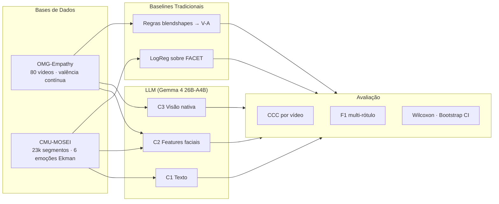
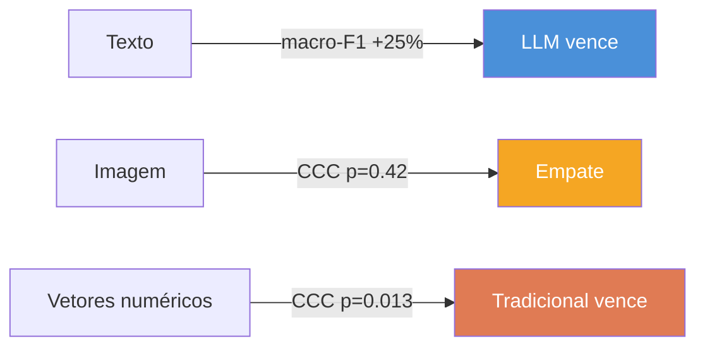

# PaperAdvanRobot

**Estudo Comparativo: LLM Multimodal vs. Métodos Tradicionais para Reconhecimento de Emoção**

> Paper para a disciplina de *Advanced Robotics* — Pipeline reprodutível para comparar
> um baseline baseado em **regras de blendshapes faciais** com um **LLM multimodal
> (Gemma 4 26B)** em duas bases de dados de computação afetiva.

---

## Visão Geral



---

## Principais Resultados

### OMG-Empathy — Valência contínua (CCC)

| Sistema | CCC médio | IC 95% |
|---|---|---|
| **LLM C3 (visão) — zero-shot** | **+0,158** | [+0,085; +0,230] |
| Baseline (regras) | +0,148 | [+0,044; +0,259] |
| LLM C2 (blendshapes) — few-shot k=3 | +0,127 | [+0,046; +0,213] |
| LLM C2 (blendshapes) — zero-shot | +0,090 | [+0,007; +0,176] |


### CMU-MOSEI — Emoção multi-rótulo (F1)

| Sistema | F1 micro | **F1 macro** | F1 ponderado |
|---|---|---|---|
| Baseline (LogReg FACET) | 0,376 | 0,333 | 0,423 |
| **LLM C1 texto — few-shot** | **0,499** | **0,416** | 0,498 |
| LLM C2 FACET — few-shot | 0,289 | 0,130 | 0,213 |


### Conclusão: Vantagem Dependente de Modalidade



> **Mensagem central:** a superioridade do LLM não é universal — é dependente
> da modalidade de entrada. Texto → LLM. Imagem → empate. Features numéricas → tradicional.

---

## Stack Técnico

| Componente | Tecnologia |
|---|---|
| Modelo LLM | Gemma 4 26B-A4B-it (MoE, 3.8B ativos/token) |
| Quantização | AWQ 4-bit |
| Serving | vLLM (API OpenAI-compatível) |
| GPU | NVIDIA L4 24 GB (GCP Spot VM) |
| Orquestração | LangGraph + LangChain |
| Features faciais | MediaPipe Face Landmarker (52 blendshapes) |
| Features MOSEI | FACET 35-dim (pré-extraída) |
| Avaliação | CCC (Lin 1989), F1 multi-rótulo, Wilcoxon, Bootstrap CI |

---

## Instalação

```bash
python3.11 -m venv .venv && source .venv/bin/activate
pip install -r requirements.txt
```

## Configuração do Modelo

O LLM é acessado via API compatível com OpenAI. Ajuste o endpoint em
`config/config.yaml` ou via variáveis de ambiente:

```bash
export LLM_BASE_URL="http://localhost:8000/v1"
export LLM_MODEL="cyankiwi/gemma-4-26B-A4B-it-AWQ-4bit"
```

## Uso

```bash
# OMG — visão nativa (C3), zero-shot
PYTHONPATH=. python scripts/eval_omg_timeseries.py --condition C3

# OMG — blendshapes (C2), few-shot k=3
PYTHONPATH=. python scripts/eval_omg_timeseries.py --condition C2 --k-shots 3

# MOSEI — texto (C1), few-shot k=5
PYTHONPATH=. python scripts/eval_mosei_multilabel.py

# Gerar gráficos e testes estatísticos
PYTHONPATH=. python scripts/generate_summary_assets.py
```

---

## Estrutura do Repositório

```
PaperAdvanRobot/
├── config/
│   └── config.yaml              # Configuração centralizada
├── src/
│   ├── config.py                # Loader de configuração (Pydantic)
│   ├── data/
│   │   ├── omg_loader.py        # Loader OMG-Empathy (vídeo + valência)
│   │   ├── mosei_loader.py      # Loader CMU-MOSEI (HDF5 .csd)
│   │   └── types.py             # Sample, GroundTruth
│   ├── features/
│   │   ├── blendshapes.py       # MediaPipe Face Landmarker (52 blendshapes)
│   │   ├── extract.py           # Extração multi-frame
│   │   └── serialize.py         # Serialização para prompts
│   ├── baseline/
│   │   └── rule_engine.py       # Regras blendshapes → valência-arousal
│   ├── llm/
│   │   ├── schema.py            # Pydantic: ValencePrediction, EmotionPrediction
│   │   ├── prompts.py           # System/user prompts calibrados
│   │   ├── graph.py             # LangGraph: state machine de inferência
│   │   ├── runner.py            # Executor de inferência em lote
│   │   └── fewshot.py           # Geração de exemplos few-shot
│   └── eval/
│       ├── metrics.py           # CCC, F1, CCC por vídeo
│       └── stats.py             # McNemar, bootstrap CI
├── scripts/
│   ├── eval_omg_timeseries.py   # Avaliação OMG (protocolo oficial CCC)
│   ├── eval_mosei_multilabel.py # Avaliação MOSEI (F1 multi-rótulo)
│   └── generate_summary_assets.py # Gráficos + testes estatísticos
├── paper/
│   ├── results.md               # Seção de resultados (artigo acadêmico)
│   ├── biblio.md                # Bibliografia (16 referências)
│   ├── datasource.md            # Pipelines de dados e protocolos
│   └── figures/                 # Gráficos do paper (PNG)
├── results/
│   ├── summary.md               # Resultados consolidados
│   ├── figures/                 # Gráficos gerados
│   ├── stats_report.txt         # Relatório de testes estatísticos
│   └── *.log, *.parquet         # Logs e dados brutos de avaliação
└── docs/
    ├── arch.md                  # Arquitetura C4 + UML (Mermaid)
    └── techspec.md              # Especificação técnica completa
```

## Condições Experimentais

| Condição | Entrada | Datasets | Descrição |
|---|---|---|---|
| **C1** | Transcrição de texto | MOSEI | O LLM recebe o que a pessoa disse |
| **C2** | Features faciais serializadas | OMG + MOSEI | Blendshapes (OMG) ou FACET (MOSEI) como texto |
| **C3** | Frames JPEG (visão nativa) | OMG | 3 keyframes por janela de 4 s |

> O MOSEI não disponibiliza vídeo bruto — apenas features pré-extraídas.
> Por isso C3 fica restrito ao OMG e C2 no MOSEI usa FACET como proxy.

---

## Documentação

| Documento | Descrição |
|---|---|
| [`paper/results.md`](paper/results.md) | Seção de resultados do paper (formato artigo, com citações) |
| [`paper/biblio.md`](paper/biblio.md) | Bibliografia completa (16 referências com BibTeX) |
| [`paper/datasource.md`](paper/datasource.md) | Pipelines de dados, protocolos e reprodutibilidade |
| [`results/summary.md`](results/summary.md) | Resultados consolidados com diagramas Mermaid |
| [`docs/arch.md`](docs/arch.md) | Arquitetura do sistema (C4 + UML) |
| [`docs/techspec.md`](docs/techspec.md) | Especificação técnica completa |

---

## Referências Principais

- Barros et al. (2019) — [OMG-Empathy Dataset](https://arxiv.org/abs/1908.11706)
- Zadeh et al. (2018) — [CMU-MOSEI](https://aclanthology.org/P18-1208/)
- Gemma Team (2025) — [Gemma 3 Technical Report](https://arxiv.org/abs/2503.19786)
- Kwon et al. (2023) — [vLLM / PagedAttention](https://arxiv.org/abs/2309.06180)
- Lin et al. (2024) — [AWQ Quantization](https://arxiv.org/abs/2306.00978)
- Surdulescu et al. (2023) — [MediaPipe Blendshapes GHUM](https://arxiv.org/abs/2309.05782)
- Lin (1989) — [Concordance Correlation Coefficient](https://doi.org/10.2307/2532051)
- Ekman (1992) — [Basic Emotions](https://doi.org/10.1080/02699939208411068)

---

## Licença

Este repositório contém código e documentação do estudo. As bases de dados
(OMG-Empathy e CMU-MOSEI) são propriedade de seus respectivos autores e devem
ser obtidas separadamente.
