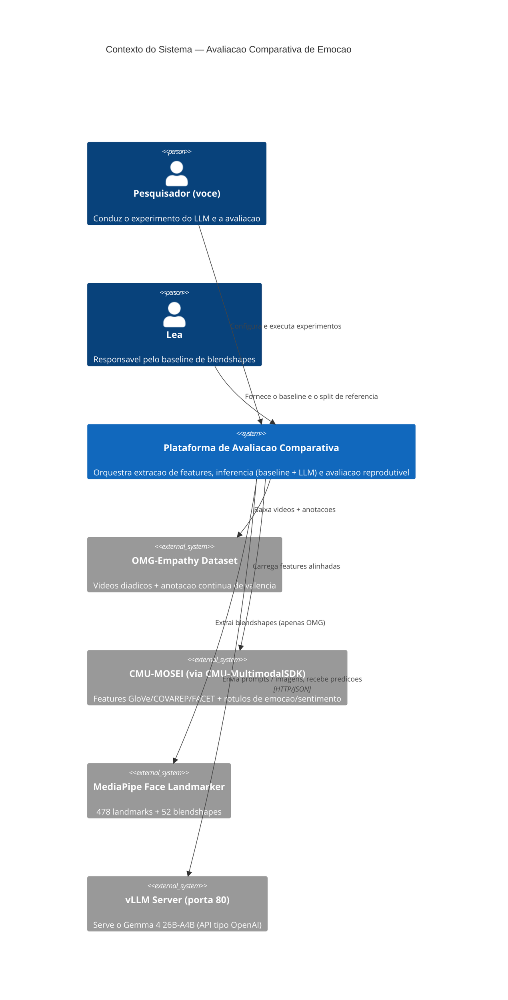
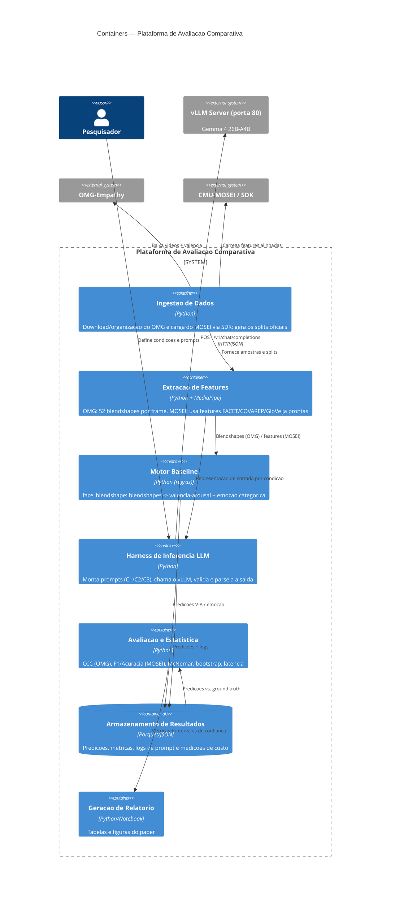
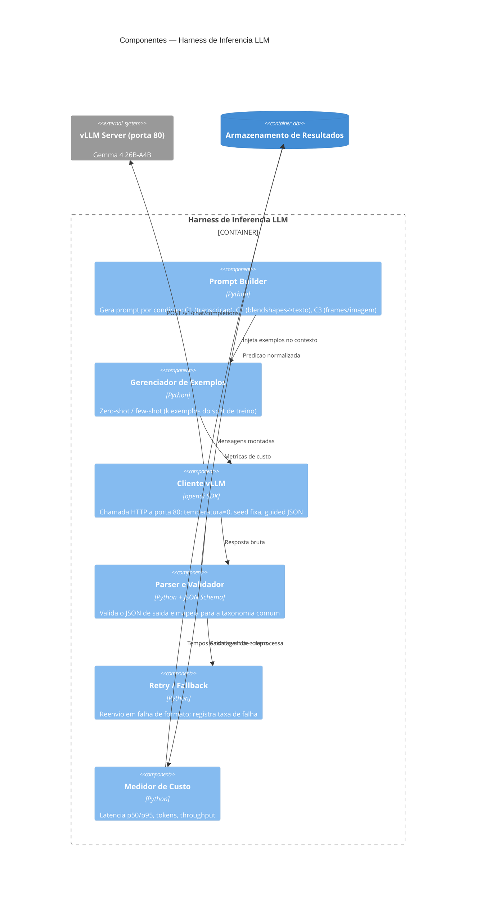
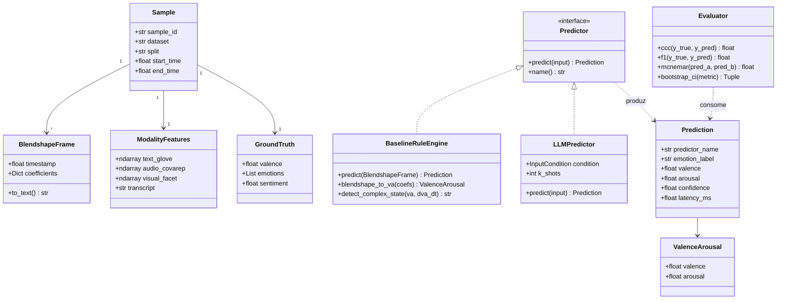
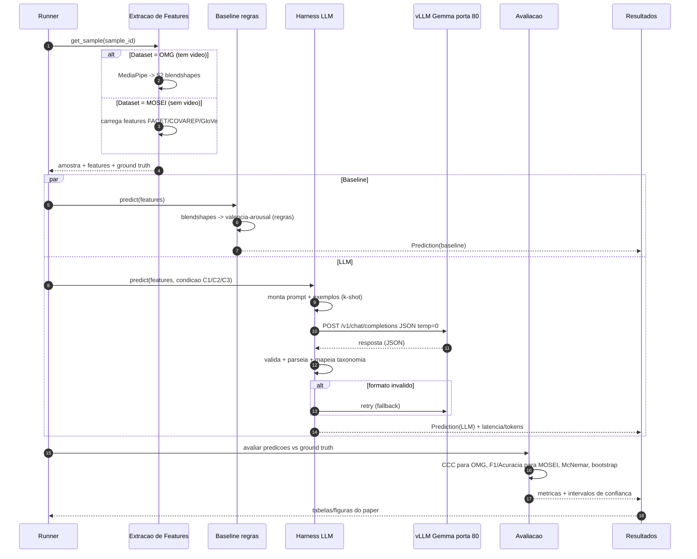

# Arquitetura — Estudo Comparativo de Reconhecimento de Emoção (Baseline por Regras vs. LLM)

> Paper para a *Advanced Robotics*. Comparação entre o método baseado em **blendshapes faciais → valência-arousal por regras** (`face_blendshape`) e um **LLM multimodal (Gemma 4 26B-A4B)** servido via vLLM.
> Bases de dados: **OMG-Empathy** (com vídeo) e **CMU-MOSEI** (apenas features pré-processadas).

## 1. Visão geral

O objetivo do sistema é executar, de forma reprodutível, o mesmo protocolo de avaliação sobre dois sistemas de predição de emoção e produzir as tabelas/figuras do paper.

Restrições de design que moldam a arquitetura:

- **OMG-Empathy** disponibiliza **vídeo bruto** → permite extrair os 52 blendshapes do MediaPipe e rodar o baseline original. Tarefa = **regressão de valência contínua** (métrica **CCC**).
- **CMU-MOSEI** **não** disponibiliza vídeo bruto (só features FACET/COVAREP/GloVe via SDK) → o pipeline de blendshapes não roda; usa-se modalidade textual/facial pré-extraída. Tarefa = **classificação de emoção** (métrica **F1/acurácia**).
- O **LLM** é acessado por uma **API compatível com OpenAI** exposta pelo vLLM na **porta 80** (modelo `gemma-4-26B-A4B-it-AWQ-4bit`, L4 24GB).
- Comparação justa: em pelo menos uma condição, baseline e LLM recebem **a mesma entrada** (blendshapes serializados em texto — condição C2).

---

## 2. C4 — Nível 1: Contexto

---

## 3. C4 — Nível 2: Containers

---

## 4. C4 — Nível 3: Componentes do Harness de Inferência LLM

---

## 5. UML — Diagrama de Classes (modelo de dados e núcleo)

---

## 6. UML — Diagrama de Sequência (avaliação de uma amostra)

---

## 7. Condições experimentais (entrada do LLM)

| Condição | Entrada do LLM | Comparável ao baseline? | Datasets |
|---|---|---|---|
| **C1** | Transcrição/texto da fala | Indireta (texto vs. facial) | MOSEI |
| **C2** | 52 blendshapes serializados em texto/JSON | **Direta (mesma feature)** | OMG (e MOSEI se usar FACET) |
| **C3** | Frames de vídeo (visão nativa do Gemma) | Não (sem equivalente clássico) | OMG (tem vídeo) |

## 8. Métricas por dataset

| Dataset | Tarefa | Métrica primária | Métricas secundárias |
|---|---|---|---|
| **OMG-Empathy** | Regressão de valência contínua | **CCC** | RMSE, Pearson |
| **CMU-MOSEI** | Classificação de emoção (Ekman) | **F1 ponderado** | Acurácia, matriz de confusão |
| **Ambos** | Viabilidade em robótica | **Latência p50/p95** | Throughput, memória, tokens |

## 9. Decisões e premissas

- Saída do LLM forçada via **guided JSON decoding** do vLLM; `temperature=0` e `seed` fixa, com **3 execuções** para reportar média ± desvio.
- **Split oficial** de cada base, idêntico ao usado pela Léa (a confirmar por e-mail).
- Taxonomia comum mapeada a partir do conjunto Ekman; `Contempt`/estados complexos do baseline tratados em apêndice.
- Limitação declarada: possível contaminação do MOSEI no pré-treino do LLM.
