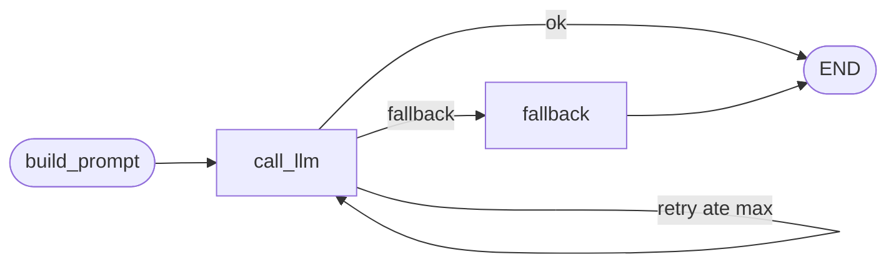

# Especificação Técnica — Comparativo de Reconhecimento de Emoção (Baseline por Regras vs. LLM)

> Implementação em **Python + LangGraph**, usando o **Gemma 4 26B-A4B** servido por **vLLM** (API compatível com OpenAI) e acessado via `langchain_openai.ChatOpenAI`.
> Documento de referência para implementação. A arquitetura conceitual (C4/UML) está em [`arch.md`](../arch.md).

---

## 1. Objetivo e escopo

Construir um pipeline reprodutível que execute o mesmo protocolo de avaliação sobre dois preditores de emoção e gere as tabelas/figuras do paper para a *Advanced Robotics*:

- **Baseline**: módulo `face_blendshape` — mapeia 52 blendshapes faciais (MediaPipe) para **valência-arousal (V-A)** por regras.
- **LLM**: `gemma-4-26B-A4B-it-AWQ-4bit`, zero/few-shot, em 3 condições de entrada (C1/C2/C3).

**Datasets e tarefas:**

| Dataset | Modalidade disponível | Tarefa | Métrica primária |
|---|---|---|---|
| **OMG-Empathy** | Vídeo bruto | Regressão de valência contínua | **CCC** |
| **CMU-MOSEI** | Features FACET/COVAREP/GloVe (sem vídeo) | Classificação de emoção (Ekman) | **F1 ponderado** |

---

## 2. Stack tecnológico

| Camada | Tecnologia |
|---|---|
| Linguagem | Python 3.11 |
| Orquestração do LLM | **LangGraph** (`StateGraph`) |
| Cliente do modelo | `langchain-openai` (`ChatOpenAI`) |
| Serving do modelo | vLLM 0.22.0 (OpenAI-compatible, `/v1`) |
| Saída estruturada | Pydantic v2 + `with_structured_output` (JSON Schema / guided decoding do vLLM) |
| Extração facial | MediaPipe Face Landmarker (52 blendshapes) |
| Carga do MOSEI | CMU-MultimodalSDK (`mmsdk`) |
| Dados/numérico | numpy, pandas, h5py |
| Avaliação | scikit-learn, scipy, statsmodels |
| Config/CLI | pydantic-settings, PyYAML, Typer, tqdm |

### 2.1 Conexão com o modelo

```python
from langchain_openai import ChatOpenAI

llm = ChatOpenAI(
    base_url="http://localhost:8000/v1",
    model="cyankiwi/gemma-4-26B-A4B-it-AWQ-4bit",
    api_key="not-needed",
    temperature=0,
    max_retries=0,   # o retry é controlado pelo grafo, nao pelo client
    timeout=120,
)
```

> O `base_url` e o `model` ficam em `config.yaml`/variáveis de ambiente (`LLM_BASE_URL`, `LLM_MODEL`). Use a porta que o vLLM estiver expondo (8000 no dev, 80 em produção).

---

## 3. Estrutura do repositório

```
PaperAdvanRobot/
├── arch.md
├── docs/
│   └── techspec.md
├── config/
│   ├── config.yaml              # endpoints, paths, condicoes, seeds
│   └── prompts/                 # templates C1/C2/C3 (system + user) e few-shot
├── src/
│   ├── data/
│   │   ├── omg_loader.py        # download/organizacao + anotacao de valencia
│   │   ├── mosei_loader.py      # carga via mmsdk + alinhamento
│   │   └── splits.py            # splits oficiais
│   ├── features/
│   │   ├── blendshapes.py       # MediaPipe -> 52 coeficientes (OMG)
│   │   └── serialize.py         # blendshapes -> texto/JSON (condicao C2)
│   ├── baseline/
│   │   └── rule_engine.py       # face_blendshape: blendshapes -> V-A
│   ├── llm/
│   │   ├── schema.py            # Pydantic: EmotionPrediction / ValencePrediction
│   │   ├── prompts.py           # montagem de mensagens por condicao
│   │   ├── graph.py             # LangGraph StateGraph
│   │   └── runner.py            # itera o dataset, persiste resultados
│   ├── eval/
│   │   ├── metrics.py           # CCC, F1, acuracia
│   │   └── stats.py             # McNemar, bootstrap CI
│   └── report/
│       └── build_tables.py      # tabelas/figuras do paper
├── results/                     # parquet/json com predicoes e metricas
├── tests/
├── requirements.txt
└── README.md
```

---

## 4. Modelo de dados (Pydantic)

```python
# src/llm/schema.py
from typing import Literal, Optional
from pydantic import BaseModel, Field

EMOTIONS = ["happiness", "sadness", "anger", "fear", "disgust", "surprise", "neutral"]

class EmotionPrediction(BaseModel):
    """Saida estruturada do LLM para classificacao (MOSEI)."""
    emotion_label: Literal["happiness", "sadness", "anger", "fear",
                           "disgust", "surprise", "neutral"]
    valence: float = Field(ge=-1.0, le=1.0)
    arousal: float = Field(ge=-1.0, le=1.0)
    confidence: float = Field(ge=0.0, le=1.0)
    rationale: Optional[str] = Field(default=None, max_length=280)

class ValencePrediction(BaseModel):
    """Saida estruturada do LLM para regressao de valencia (OMG)."""
    valence: float = Field(ge=-1.0, le=1.0)
    confidence: float = Field(ge=0.0, le=1.0)
    rationale: Optional[str] = Field(default=None, max_length=280)
```

> O schema vira JSON Schema e é passado ao vLLM por `with_structured_output(...)`, ativando *guided decoding* (saída sempre válida).

---

## 5. Camada de dados

### 5.1 OMG-Empathy (`omg_loader.py`)
- Descompacta o zip (senha fornecida), organiza vídeos por sujeito/história e carrega as anotações contínuas de valência (CSV por frame).
- Gera amostras por **janela temporal** de `window_s` segundos (default 4 s) com a valência média como rótulo da janela (configurável).
- Mantém os tracks oficiais (**Personalized** / **Generalized**).

### 5.2 CMU-MOSEI (`mosei_loader.py`)
```python
from mmsdk import mmdatasdk

ds = mmdatasdk.mmdataset(mmdatasdk.cmu_mosei.highlevel, "data/mosei/")
ds.add_computational_sequences(mmdatasdk.cmu_mosei.labels, "data/mosei/")
ds.align("All Labels")
```
- Usa as features pré-extraídas: **GloVe (texto)**, **COVAREP (áudio)**, **FACET (facial)** + transcrição.
- **Não há vídeo bruto** → o pipeline de blendshapes do MediaPipe **não** é aplicado ao MOSEI (ver §6).
- Converte os scores de emoção do MOSEI em rótulos multi-classe/multi-rótulo conforme a taxonomia comum.

### 5.3 Splits (`splits.py`)
- Usa o split **oficial** de cada base (idêntico ao do baseline da Léa — a confirmar).
- Few-shot: os `k` exemplos vêm **somente do split de treino** (evita vazamento no teste).

---

## 6. Extração de features

| Condição | OMG-Empathy | CMU-MOSEI |
|---|---|---|
| **C1** (texto) | transcrição (se disponível) | transcrição GloVe/raw |
| **C2** (blendshapes→texto) | MediaPipe 52 coefs → JSON | FACET facial → JSON (proxy) |
| **C3** (multimodal/imagem) | keyframe(s) do vídeo | N/A (sem vídeo) |

```python
# src/features/serialize.py
def blendshapes_to_text(coefs: dict[str, float], top_n: int = 15) -> str:
    """Serializa os blendshapes mais salientes para o prompt (condicao C2)."""
    top = sorted(coefs.items(), key=lambda kv: kv[1], reverse=True)[:top_n]
    return "\n".join(f"- {name}: {score:.2f}" for name, score in top)
```

---

## 7. Baseline (`rule_engine.py`)
- Reimplementa/empacota a lógica do `face_blendshape`: blendshapes → V-A por regras + emoção categórica + estados complexos.
- Expõe a mesma interface do preditor LLM (`predict(input) -> Prediction`) para a avaliação reaproveitar o mesmo código.

```python
class BaselineRuleEngine:
    name = "baseline_rules"
    def predict(self, coefs: dict[str, float]) -> dict:
        v, a = self._blendshape_to_va(coefs)
        return {"predictor_name": self.name, "valence": v, "arousal": a,
                "emotion_label": self._va_to_label(v, a), "confidence": 1.0}
```

---

## 8. Orquestração com LangGraph (`graph.py`)

O LLM é executado por um `StateGraph` que monta o prompt, chama o modelo com saída estruturada, valida e faz fallback em caso de falha.

### 8.1 Estado do grafo
```python
from typing import TypedDict, Literal, Optional
from langchain_core.messages import BaseMessage

class GraphState(TypedDict):
    sample_id: str
    dataset: Literal["omg", "mosei"]
    task: Literal["valence", "emotion"]
    condition: Literal["C1", "C2", "C3"]
    k_shots: int
    features: dict                 # transcript / blendshapes / image_b64
    messages: list[BaseMessage]
    prediction: Optional[dict]
    attempts: int
    max_attempts: int
    error: Optional[str]
    latency_ms: Optional[float]
```

### 8.2 Nós
```python
import time
from langgraph.graph import StateGraph, END
from langchain_openai import ChatOpenAI
from .schema import EmotionPrediction, ValencePrediction
from .prompts import build_messages

def _llm_for(task: str):
    base = ChatOpenAI(base_url=CFG.llm_base_url, model=CFG.llm_model,
                      api_key="not-needed", temperature=0, max_retries=0)
    schema = ValencePrediction if task == "valence" else EmotionPrediction
    return base.with_structured_output(schema, method="json_schema")

def build_prompt(state: GraphState) -> dict:
    return {"messages": build_messages(state)}

def call_llm(state: GraphState) -> dict:
    t0 = time.perf_counter()
    try:
        out = _llm_for(state["task"]).invoke(state["messages"])
        return {"prediction": out.model_dump(),
                "latency_ms": (time.perf_counter() - t0) * 1000,
                "error": None}
    except Exception as e:  # formato/timeout
        return {"error": str(e), "attempts": state["attempts"] + 1,
                "latency_ms": (time.perf_counter() - t0) * 1000}

def fallback(state: GraphState) -> dict:
    # rotulo neutro quando o modelo falha apos max_attempts
    pred = {"emotion_label": "neutral", "valence": 0.0, "arousal": 0.0,
            "confidence": 0.0, "fallback": True}
    return {"prediction": pred}

def route_after_llm(state: GraphState) -> str:
    if state.get("prediction") is not None:
        return "ok"
    if state["attempts"] < state["max_attempts"]:
        return "retry"
    return "fallback"
```

### 8.3 Montagem do grafo
```python
def build_graph():
    g = StateGraph(GraphState)
    g.add_node("build_prompt", build_prompt)
    g.add_node("call_llm", call_llm)
    g.add_node("fallback", fallback)

    g.set_entry_point("build_prompt")
    g.add_edge("build_prompt", "call_llm")
    g.add_conditional_edges("call_llm", route_after_llm,
                            {"ok": END, "retry": "call_llm", "fallback": "fallback"})
    g.add_edge("fallback", END)
    return g.compile()
```



### 8.4 Prompts por condição (`prompts.py`)
```python
from langchain_core.messages import SystemMessage, HumanMessage

SYSTEM = ("Voce e um analista de emocao. Responda APENAS no schema JSON pedido. "
          "Use a taxonomia: happiness, sadness, anger, fear, disgust, surprise, neutral.")

def build_messages(state) -> list:
    f = state["features"]
    if state["condition"] == "C1":            # texto
        user = [{"type": "text", "text": f"Transcricao: {f['transcript']}"}]
    elif state["condition"] == "C2":          # blendshapes -> texto
        user = [{"type": "text", "text": f"Blendshapes faciais:\n{f['blendshapes_text']}"}]
    else:                                     # C3 multimodal
        user = [{"type": "text", "text": "Classifique a emocao desta face."},
                {"type": "image_url",
                 "image_url": {"url": f"data:image/jpeg;base64,{f['image_b64']}"}}]
    return [SystemMessage(content=SYSTEM)] + few_shot(state) + [HumanMessage(content=user)]
```

### 8.5 Runner (`runner.py`)
- Itera as amostras do split de teste, invoca `graph.invoke(state)` (ou `graph.batch(...)` com `max_concurrency`), e persiste em `results/<dataset>_<condition>_<seed>.parquet`.
- Roda **3 seeds** e `temperature=0`; agrega média ± desvio.
- Registra latência por amostra, contagem de tokens e taxa de fallback.

---

## 9. Avaliação (`eval/`)

```python
# src/eval/metrics.py
import numpy as np

def ccc(y_true, y_pred):
    yt, yp = np.asarray(y_true), np.asarray(y_pred)
    cov = np.cov(yt, yp)[0, 1]
    return (2 * cov) / (yt.var() + yp.var() + (yt.mean() - yp.mean())**2)
```

| Métrica | Onde | Lib |
|---|---|---|
| **CCC**, RMSE, Pearson | OMG (valência) | numpy/scipy |
| **F1 ponderado**, acurácia, matriz de confusão | MOSEI (emoção) | scikit-learn |
| **McNemar** (baseline vs LLM, pareado) | MOSEI | statsmodels |
| **Bootstrap CI** | ambos | scipy/numpy |
| **Latência p50/p95**, throughput, tokens | ambos | medido no runner |

---

## 10. Configuração e reprodutibilidade

```yaml
# config/config.yaml
llm:
  base_url: "http://localhost:8000/v1"
  model: "cyankiwi/gemma-4-26B-A4B-it-AWQ-4bit"
  temperature: 0
run:
  seeds: [13, 42, 1234]
  max_attempts: 3
  max_concurrency: 8
  conditions: ["C1", "C2", "C3"]
data:
  omg_path: "data/omg/"
  mosei_path: "data/mosei/"
  window_s: 4
```

- Saída forçada por schema (sem parsing frágil); `temperature=0` + seed fixa; 3 execuções.
- Versões fixadas em `requirements.txt`; hash do split salvo junto dos resultados.

---

## 11. Dependências (`requirements.txt`)

```
python>=3.11
langgraph
langchain
langchain-openai
pydantic>=2
pydantic-settings
mediapipe
opencv-python
numpy
pandas
h5py
scikit-learn
scipy
statsmodels
pyyaml
typer
tqdm
# CMU-MultimodalSDK instalado via git:
# pip install git+https://github.com/CMU-MultiComp-Lab/CMU-MultimodalSDK.git
```

---

## 12. Plano de execução (milestones)

1. **M1 — Dados**: loaders OMG + MOSEI, splits oficiais, sanity checks.
2. **M2 — Features**: blendshapes (OMG) + serialização C2; carga FACET/GloVe (MOSEI).
3. **M3 — Baseline**: empacotar `rule_engine` na interface de preditor.
4. **M4 — LLM/LangGraph**: grafo + schema + prompts C1/C2/C3 + runner.
5. **M5 — Avaliação**: CCC/F1, McNemar, bootstrap, latência.
6. **M6 — Relatório**: tabelas/figuras e discussão de viabilidade (RQ2).

---

## 13. Riscos e mitigações

| Risco | Mitigação |
|---|---|
| MOSEI sem vídeo → sem blendshapes | C2 usa FACET como proxy; blendshapes nativos só no OMG |
| Falha de formato do LLM | guided decoding + retry + fallback no grafo |
| Não-determinismo (MoE/vLLM) | 3 seeds, média ± desvio |
| Contaminação de treino (MOSEI) | declarada como limitação |
| Sensibilidade ao prompt | ≥2 variantes de prompt reportadas |
