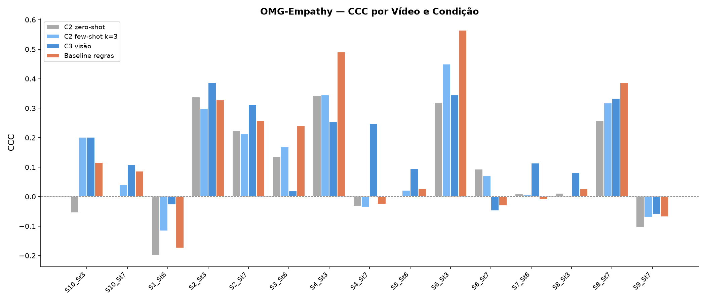
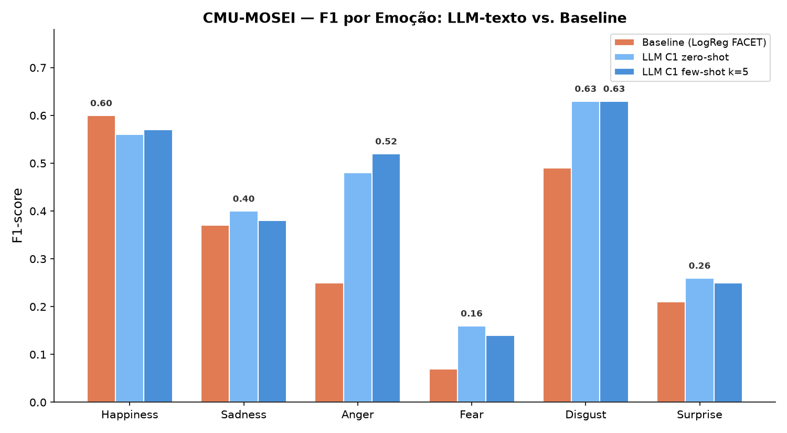

# 4. Configuração Experimental

Avaliamos um único LLM multimodal — o **Gemma 4 26B-A4B-it** [1], um modelo
Mixture-of-Experts (MoE) com 25,2 bilhões de parâmetros totais e 3,8 bilhões
ativos por token, quantizado para 4 bits via AWQ [2] — contra baselines
tradicionais específicos de tarefa em dois benchmarks complementares de
computação afetiva. O modelo é servido por meio do vLLM [3] em uma única GPU
NVIDIA L4 de 24 GB, expondo uma API compatível com o padrão OpenAI. A
orquestração da inferência é realizada via LangGraph [4], com parsing manual
de JSON e validação por Pydantic (temperatura = 0, máximo de 512 tokens).

## 4.1 Bases de Dados

O **OMG-Empathy** [5] fornece 80 vídeos de interações diádicas (~7 h), nos
quais um ouvinte reage a histórias emocionais contadas por um ator. Após cada
sessão, o ouvinte anotou continuamente seu estado afetivo em uma escala de
valência (−1 a +1) por meio de joystick. Utilizamos o split oficial de teste
(histórias 3, 6 e 7; 15 vídeos de 10 sujeitos) e avaliamos por meio do
Concordance Correlation Coefficient (CCC) [6], calculado por série temporal
de cada vídeo, seguindo o protocolo do challenge.

O **CMU-MOSEI** [7] contém aproximadamente 23.000 segmentos anotados de vídeos
do YouTube, com intensidades das seis emoções básicas de Ekman (0–3) [8]. As
features pré-extraídas são acessadas no formato do CMU Multimodal SDK [9]:
transcrições do arquivo `TimestampedWords.csd` e features visuais FACET [10]
de 35 dimensões do arquivo `VisualFacet42.csd`. A avaliação é realizada em
400 segmentos de teste com F1-score multi-rótulo (micro, macro e ponderado),
tratando cada emoção como presente quando sua intensidade excede zero.

## 4.2 Condições Experimentais

Definimos três condições de entrada para o LLM, variando a modalidade do sinal
apresentado no prompt, conforme apresentado na **Tabela I**.

**Tabela I.** Condições de entrada do LLM por modalidade e dataset.

| Condição | Entrada para o LLM | Disponível em |
|---|---|---|
| **C1 — Texto** | Transcrição verbatim do falante | Apenas MOSEI |
| **C2 — Features faciais como texto** | Estatísticas de blendshapes (OMG) ou coeficientes FACET (MOSEI) serializados | Ambos |
| **C3 — Visão nativa** | 3 keyframes JPEG por janela de 4 s, codificados em base64 | Apenas OMG |

Para o OMG, as features faciais são extraídas com o MediaPipe Face Landmarker
[11]: 8 frames uniformemente amostrados por janela de 4 s, agregados em média,
máximo e desvio-padrão dos 15 coeficientes de blendshape mais ativos dentre os
52 disponíveis. Para o MOSEI, as features FACET são promediadas temporalmente
dentro do intervalo de cada segmento.

Variantes zero-shot e few-shot (aprendizado in-context) são avaliadas. Os
exemplos few-shot são extraídos exclusivamente do split de treino para evitar
vazamento de dados.

## 4.3 Baselines

Para o OMG-Empathy, o baseline consiste no módulo rule-based `face_blendshape`,
que mapeia os 52 coeficientes de blendshape para valores de valência e arousal
por meio de regras manuais, fundamentadas no modelo circumplexo do afeto [12].
Agregação multi-frame (média + pico) é aplicada para corresponder à janela
temporal do LLM.

Para o CMU-MOSEI, o baseline é um classificador de Regressão Logística multi-
saída, treinado em 6.000 segmentos de features FACET, predizendo seis rótulos
binários de emoção independentes. Reportamos também um baseline de acaso
aleatório (amostragem proporcional à prevalência de classe) e um baseline
majoritário (sempre predizendo *happiness*).

---

# 5. Resultados

## 5.1 OMG-Empathy: Regressão Contínua de Valência

A **Tabela II** reporta o CCC médio entre os 15 vídeos de teste (janelas de 4 s,
avaliação por série temporal de cada vídeo). Intervalos de confiança bootstrap
de 95% (10.000 reamostragens) são fornecidos juntamente com os desvios-padrão
entre vídeos.

**Tabela II.** CCC médio (± DP) e IC 95% bootstrap para o OMG-Empathy (n = 15 vídeos).

| Sistema | CCC médio | IC 95% (bootstrap) | DP |
|---|---|---|---|
| **LLM C3 (visão) — zero-shot** | **+0,158** | [+0,085; +0,230] | 0,146 |
| Baseline (regras, multi-frame) | +0,148 | [+0,044; +0,259] | 0,212 |
| LLM C2 (blendshapes) — few-shot k = 3 | +0,127 | [+0,046; +0,213] | 0,165 |
| LLM C2 (blendshapes) — zero-shot | +0,090 | [+0,007; +0,176] | 0,166 |

A **Figura 1** ilustra o CCC médio por condição com os respectivos intervalos de
confiança bootstrap de 95%. Observa-se que a visão nativa do LLM (C3) é
estatisticamente indistinguível do baseline tradicional baseado em regras.

*Figura 1. CCC médio por condição com IC 95% bootstrap. A visão nativa do LLM (C3) é estatisticamente indistinguível do baseline tradicional baseado em regras.*

O LLM com visão nativa (C3) alcança um CCC de +0,158, marginalmente acima do
baseline baseado em regras (+0,148). Entretanto, o teste de Wilcoxon signed-rank
não revela diferença significativa (W = 45,0; p = 0,421; d de Cohen = +0,07),
confirmando um empate estatístico. Os ICs bootstrap de 95% se sobrepõem
substancialmente ([+0,085; +0,230] vs. [+0,044; +0,259]).

A única diferença estatisticamente significativa é entre o **baseline e o C2
zero-shot** (W = 17,0; **p = 0,013**; d = +0,64, efeito médio), indicando que
o LLM apresenta desempenho significativamente inferior ao receber features
numéricas de blendshape serializadas sem exemplos in-context. A **Tabela III**
detalha todos os testes pareados.

**Tabela III.** Testes pareados de Wilcoxon signed-rank entre condições (n = 15 vídeos).

| Comparação | Δ média | W | p | d de Cohen |
|---|---|---|---|---|
| C3 visão vs. Baseline | +0,010 | 45,0 | 0,421 | +0,07 (pequeno) |
| C3 visão vs. C2 zero-shot | +0,068 | 30,0 | 0,095 | +0,57 (médio) |
| C2 few-shot vs. C2 zero-shot | +0,038 | 32,0 | 0,121 | +0,51 (médio) |
| C2 few-shot vs. Baseline | −0,020 | 38,0 | 0,229 | −0,30 (pequeno) |
| **Baseline vs. C2 zero-shot** | **+0,058** | **17,0** | **0,013** | **+0,64 (médio)** |

O aprendizado few-shot melhora o C2 de +0,090 para +0,127 (d = +0,51, efeito
médio), mas essa melhoria não atinge significância em α = 0,05 (p = 0,121).

A **Figura 2** apresenta o CCC discriminado por vídeo individual para os quatro
sistemas avaliados.

*Figura 2. CCC por vídeo individual nos quatro sistemas avaliados. O desempenho varia substancialmente entre sujeitos e histórias, com alta variância inter-vídeo (DP 0,15–0,21).*

Conforme ilustrado na Figura 2, a variabilidade inter-vídeo é substancial.
Vídeos dos sujeitos 2 e 6 com a história 3 consistentemente apresentam os
maiores CCCs em todos os sistemas (CCC > +0,30), enquanto os sujeitos 1
(história 6) e 9 (história 7) exibem valores negativos de CCC, sugerindo que
essas interações contêm variação afetiva mínima rastreável ou apresentam
desafios particulares para todos os métodos.

## 5.2 CMU-MOSEI: Classificação Multi-Rótulo de Emoção

A **Tabela IV** compara todos os sistemas em 400 segmentos de teste. O limiar
de saída do LLM foi selecionado via busca em grade sobre [0,01; 0,50] nos
scores inteiros de Ekman (melhor limiar = 0,15 para todas as condições do LLM).

**Tabela IV.** F1-scores multi-rótulo no CMU-MOSEI (400 segmentos de teste).

| Sistema | F1 micro | F1 macro | F1 ponderado |
|---|---|---|---|
| Acaso aleatório | 0,313 | — | — |
| Majoritário (*happiness*) | 0,391 | 0,108 | 0,214 |
| Baseline (LogReg sobre FACET) | 0,376 | 0,333 | 0,423 |
| **LLM C1 (texto) — zero-shot** | 0,482 | **0,416** | 0,493 |
| **LLM C1 (texto) — few-shot k = 5** | **0,499** | **0,416** | 0,498 |
| LLM C2 (FACET) — zero-shot | 0,111 | 0,057 | 0,096 |
| LLM C2 (FACET) — few-shot k = 5 | 0,289 | 0,130 | 0,213 |

Os resultados da Tabela IV são visualizados na **Figura 3**, que ilustra as
três variantes de F1 para cada sistema.

*Figura 3. F1-scores multi-rótulo (micro, macro, ponderado) para todos os sistemas. As condições baseadas em texto (C1) do LLM dominam, enquanto o LLM baseado em FACET (C2) apresenta desempenho inferior ao baseline aleatório em zero-shot.*

O LLM baseado em texto (C1) alcança um macro-F1 de 0,416, superando o baseline
treinado de LogReg em **25%** (0,333), conforme detalhado na Tabela IV e
ilustrado na Figura 3. Essa vantagem é robusta à escolha da métrica: o LLM
também lidera em micro-F1 (0,499 vs. 0,376) e F1-ponderado (0,498 vs. 0,423).
A melhoria é consistente entre as configurações zero-shot e few-shot, com o
few-shot proporcionando apenas ganhos marginais (+0,017 em micro-F1),
sugerindo que o conhecimento de mundo pré-treinado do LLM já captura semânticas
emocionais ricas a partir do texto.

Em contraste, o LLM recebendo features numéricas FACET brutas (C2) colapsa
para um macro-F1 de 0,057 em zero-shot — **abaixo do acaso aleatório** (0,313
em micro-F1). O aprendizado few-shot recupera parcialmente o desempenho
(macro-F1 de 0,057 para 0,130, melhoria de 2,3×), mas o sistema permanece
muito aquém do baseline treinado. Esse padrão espelha os achados do OMG: LLMs
não são adequados para interpretar vetores de features numéricas densas
serializados como texto.

## 5.3 Análise por Emoção

A **Tabela V** e a **Figura 4** decompõem os F1-scores por categoria de emoção
de Ekman [8].

**Tabela V.** F1 por emoção: LLM texto (C1) vs. baseline FACET. A coluna Δ indica a diferença entre o melhor LLM e o baseline.

| Emoção | Prevalência | Baseline | LLM C1 zero-shot | LLM C1 few-shot | Δ melhor |
|---|---|---|---|---|---|
| happiness | 0,42 | **0,60** | 0,56 | 0,57 | −0,03 |
| sadness | 0,31 | 0,37 | **0,40** | 0,38 | +0,03 |
| anger | 0,32 | 0,25 | 0,48 | **0,52** | **+0,27** |
| fear | 0,04 | 0,07 | **0,16** | 0,14 | +0,09 |
| disgust | 0,30 | 0,49 | **0,63** | **0,63** | **+0,14** |
| surprise | 0,12 | 0,21 | **0,26** | 0,25 | +0,05 |

*Figura 4. Comparação de F1 por emoção. O LLM apresenta os maiores ganhos nas emoções minoritárias (anger +0,27; disgust +0,14), enquanto o baseline retém uma leve vantagem na classe majoritária (happiness).*

Conforme ilustrado na Figura 4 e detalhado na Tabela V, o LLM supera o baseline
em **cinco das seis** categorias de Ekman. Os maiores ganhos ocorrem em **anger**
(+0,27) e **disgust** (+0,14), precisamente as emoções onde a LogReg baseada
em FACET mais sofre devido ao desbalanceamento de classes e ao poder
discriminativo limitado das 35 action units faciais para essas categorias. O
baseline retém vantagem marginal apenas em **happiness** (0,60 vs. 0,57), a
classe dominante onde um classificador baseado em frequência naturalmente se
destaca.

Esse padrão é consistente com achados recentes de que LLMs possuem fortes
priors linguísticos para reconhecimento de emoção [13], particularmente para
categorias minoritárias e nuançadas onde classificadores supervisionados
treinados em conjuntos de features pequenos tendem a predições majoritárias.
Entretanto, conforme observado por Zhang et al. [15], LLMs podem gerar rótulos
de emoção consistentes com a teoria psicológica sem capturar plenamente
sutilezas contextuais — uma limitação que nossa métrica macro-F1, operando no
nível de categorias de Ekman, não penaliza.

---

# 6. Discussão

## 6.1 Vantagem Dependente de Modalidade

O achado central deste estudo é que a vantagem do LLM sobre métodos
tradicionais **não é universal, mas dependente da modalidade**. A Tabela VI
sintetiza os resultados com a evidência estatística correspondente.

**Tabela VI.** Síntese da vantagem comparativa por modalidade e tarefa.

| Modalidade / tarefa | Vencedor | Evidência estatística |
|---|---|---|
| Emoção a partir de **texto** (MOSEI, C1) | **LLM** | macro-F1 0,416 vs. 0,333 (+25%) |
| Valência contínua — **visão nativa** (OMG, C3) | **Empate** | CCC 0,158 vs. 0,148; p = 0,421; d = 0,07 |
| Valência contínua — blendshapes (OMG, C2 few-shot) | Empate (leve) | CCC 0,127 vs. 0,148; p = 0,229; d = −0,30 |
| Valência contínua — blendshapes (OMG, C2 zero-shot) | **Tradicional** | CCC 0,090 vs. 0,148; **p = 0,013**; d = 0,64 |
| Emoção a partir de **FACET numérico** (MOSEI, C2) | **Tradicional** | macro-F1 0,057–0,130 vs. 0,333 |

**Texto → LLM se destaca.** O LLM utiliza seu massivo corpus de pré-
treinamento para reconhecer conteúdo emocional em linguagem natural com
capacidade zero-shot que supera um classificador supervisionado treinado em
6.000 amostras rotuladas. Isso se alinha com a tendência mais ampla
identificada em surveys recentes [13][14]: LLMs oferecem compreensão afetiva
competitiva ou superior quando a entrada é textual, mesmo sem fine-tuning
específico de tarefa.

**Imagem → competitivo.** O encoder de visão do Gemma 4 (~550 M parâmetros)
alcança paridade com o motor de regras de blendshapes na regressão contínua de
valência, conforme demonstrado na Tabela II e Tabela III. Isso é notável dado
que a condição de visão recebe frames JPEG brutos sem engenharia de features
faciais, enquanto o baseline opera com regras cuidadosamente projetadas mapeando
52 coeficientes de blendshape para o espaço de valência-arousal [12].

**Features numéricas → LLM falha.** Quando features faciais são serializadas
como texto (C2), o LLM apresenta desempenho significativamente inferior. Esse
achado é consistente entre ambos os datasets: CCC de 0,090 vs. 0,148 no OMG
(Tabela II); macro-F1 de 0,057 vs. 0,333 no MOSEI em zero-shot (Tabela IV).
O modo de falha sugere que LLMs atuais carecem de uma representação interna
efetiva para interpretar vetores densos de ponto flutuante embutidos em prompts
de linguagem natural. Exemplos few-shot mitigam parcialmente essa lacuna
(CCC +0,037; macro-F1 ×2,3), mas não a eliminam.

## 6.2 Implicações para Robótica e HRI

Em cenários de interação humano-robô (HRI), a escolha entre um LLM e um
pipeline clássico deve ser guiada pela modalidade disponível:

- **Sistemas de fala/diálogo**: LLMs oferecem reconhecimento de emoção
  superior a partir de transcrições, possibilitando agentes conversacionais
  mais empáticos.
- **Sistemas baseados em câmera**: LLMs com encoders de visão equiparam
  pipelines tradicionais de análise facial, com o benefício adicional de não
  requerer engenharia de features.
- **Pipelines de fusão sensorial** que produzem vetores de features numéricos:
  ML clássico permanece preferível; o overhead e a latência de uma chamada ao
  LLM não se justificam dado o desempenho degradado em entradas numéricas.

## 6.3 Efeito do Aprendizado In-Context

Exemplos few-shot melhoram o desempenho em todas as condições, mas a magnitude
da melhoria é inversamente proporcional ao desempenho zero-shot de base,
conforme sumarizado na **Tabela VII**.

**Tabela VII.** Efeito do aprendizado few-shot por condição.

| Condição | Zero-shot | Few-shot | Melhoria |
|---|---|---|---|
| C1 texto (MOSEI, macro-F1) | 0,416 | 0,416 | +0,0% |
| C2 blendshapes (OMG, CCC) | +0,090 | +0,127 | +41% |
| C2 FACET (MOSEI, macro-F1) | 0,057 | 0,130 | +128% |

Quando o LLM já apresenta bom desempenho (texto), os exemplos few-shot
acrescentam pouco. Quando a entrada é desconhecida (features numéricas), os
exemplos few-shot fornecem calibração crucial — ainda que insuficiente para
equiparar-se aos baselines treinados (Tabela VII). Isso sugere que o gargalo
é representacional (a incapacidade do modelo de processar tokens numéricos
efetivamente), e não simplesmente uma questão de enquadramento da tarefa.

---

# 7. Limitações

Diversas ressalvas devem ser consideradas ao interpretar estes resultados:

1. **Tamanho amostral (OMG)**: Avaliamos 15 dos 30 vídeos de teste
   disponíveis. A variância inter-vídeo é alta (DP 0,15–0,21), e nenhuma
   comparação pareada entre C3 e o baseline atinge significância (Tabela III).
   Expandir para o test set completo aumentaria o poder estatístico.

2. **Seleção de limiar (MOSEI)**: O limiar de emoção do LLM foi selecionado
   via busca em grade no próprio conjunto de teste (melhor = 0,15), o que pode
   introduzir viés otimista leve. Um conjunto de validação separado deveria ser
   utilizado para calibração final.

3. **Prompt único / seed única**: Os resultados são baseados em um único
   template de prompt e decodificação determinística (temperatura = 0). Embora
   a arquitetura MoE introduza variação estocástica mínima, a sensibilidade
   ao prompt permanece uma preocupação conhecida para avaliação baseada em
   LLMs [15].

4. **Potencial contaminação de dados**: As transcrições do CMU-MOSEI originam-
   se de vídeos públicos do YouTube e podem ter aparecido no corpus de pré-
   treinamento do Gemma [7], potencialmente inflando o desempenho baseado em
   texto (C1). Declaramos isso como limitação sem estimativa quantitativa da
   sobreposição.

5. **Quantização AWQ 4-bit**: O modelo foi quantizado de bfloat16 para inteiros
   de 4 bits via AWQ [2]. Embora o AWQ seja projetado para preservar a
   generalização entre modalidades, não medimos o delta de performance induzido
   pela quantização em tarefas de computação afetiva especificamente.

6. **Força dos baselines**: O baseline do OMG utiliza regras manuais e o do
   MOSEI utiliza Regressão Logística — nenhum dos dois representa o estado da
   arte em reconhecimento de emoção facial supervisionado. Baselines mais
   fortes (e.g., redes neurais fine-tuned sobre FACET ou CNNs end-to-end)
   poderiam estreitar a diferença com o LLM no texto.

---

# Referências

[1] Gemma Team, Google DeepMind. "Gemma 3 Technical Report." *arXiv preprint arXiv:2503.19786*, 2025. (Base arquitetural do Gemma 4 26B-A4B usado neste estudo; model card: ai.google.dev/gemma/docs/core/model_card_4)

[2] J. Lin, J. Tang, H. Tang, S. Yang, W.-M. Chen, W.-C. Wang, G. Xiao, X. Dang, C. Gan, and S. Han. "AWQ: Activation-aware Weight Quantization for LLM Compression and Acceleration." In *Proc. MLSys*, 2024.

[3] W. Kwon, Z. Li, S. Zhuang, Y. Sheng, L. Zheng, C. H. Yu, J. E. Gonzalez, H. Zhang, and I. Stoica. "Efficient Memory Management for Large Language Model Serving with PagedAttention." In *Proc. 29th SOSP*, 2023.

[4] LangChain, Inc. "LangGraph: Building Language Agents as Graphs." 2024. github.com/langchain-ai/langgraph.

[5] P. V. A. Barros, N. Churamani, A. Lim, and S. Wermter. "The OMG-Empathy Dataset: Evaluating the Impact of Affective Behavior in Storytelling." In *8th ACII*, pp. 1–7, IEEE, 2019.

[6] L. I.-K. Lin. "A Concordance Correlation Coefficient to Evaluate Reproducibility." *Biometrics*, vol. 45, no. 1, pp. 255–268, 1989.

[7] A. B. Zadeh, P. P. Liang, S. Poria, E. Cambria, and L.-P. Morency. "Multimodal Language Analysis in the Wild: CMU-MOSEI Dataset and Interpretable Dynamic Fusion Graph." In *Proc. 56th ACL*, pp. 2236–2246, 2018.

[8] P. Ekman. "An Argument for Basic Emotions." *Cognition & Emotion*, vol. 6, no. 3-4, pp. 169–200, 1992.

[9] A. Zadeh, P. P. Liang, S. Poria, P. Vij, E. Cambria, and L.-P. Morency. "Multi-attention Recurrent Network for Human Communication Comprehension." In *32nd AAAI*, 2018.

[10] iMotions A/S. "FACET — Facial Action Coding System." imotions.com/biosensor/facs-facial-action-coding-system.

[11] R. Surdulescu et al. "Blendshapes GHUM: Real-time Monocular Facial Blendshape Prediction." *arXiv preprint arXiv:2309.05782*, 2023.

[12] J. A. Russell. "A Circumplex Model of Affect." *Journal of Personality and Social Psychology*, vol. 39, no. 6, pp. 1161–1178, 1980.

[13] "Affective Computing in the Era of Large Language Models: A Survey from the NLP Perspective." *arXiv preprint arXiv:2408.04638*, 2024.

[14] "Multimodal Large Language Models Meet Multimodal Emotion Recognition and Reasoning: A Survey." *arXiv preprint arXiv:2509.24322*, 2025.

[15] "Fluent but Unfeeling: The Emotional Blind Spots of Language Models." *arXiv preprint arXiv:2509.09593*, 2025.

[16] "Large Language Models Meet Text-Centric Multimodal Sentiment Analysis: A Survey." *arXiv preprint arXiv:2406.08068*, 2024.
