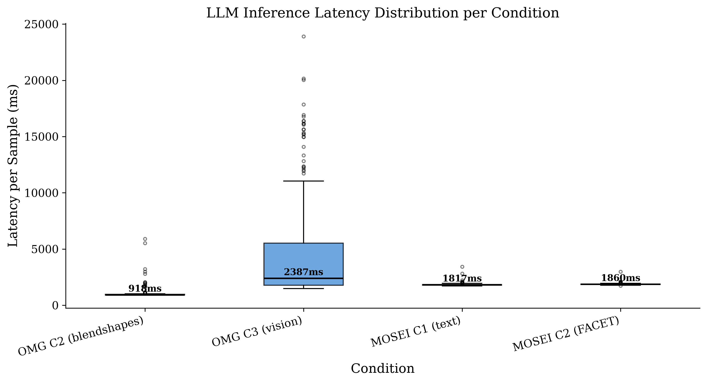

# IV. EXPERIMENTAL SETUP

This study evaluates a single multimodal LLM — **Gemma 4 26B-A4B-it** [1], a Mixture-of-Experts (MoE) model with 25.2 billion total parameters and 3.8 billion active per token, quantized to 4-bit integers via AWQ [2] — against task-specific traditional baselines on two complementary affective computing benchmarks. The model is served through vLLM [3] on a single NVIDIA L4 24 GB GPU, exposing an OpenAI-compatible API. Inference orchestration is performed via LangGraph [4], with manual JSON parsing and Pydantic validation (temperature = 0, max tokens = 512).

## A. Datasets

The **OMG-Empathy** dataset [5] provides 80 videos of dyadic interactions (~7 h), in which a listener reacts to emotional stories told by an actor. After each session, the listener continuously annotated their affective state on a valence scale (−1 to +1) via joystick. The official test split (stories 3, 6, and 7; 15 videos from 10 subjects) is used, and evaluation follows the challenge protocol using the Concordance Correlation Coefficient (CCC) [6] computed per video time-series.

The **CMU-MOSEI** dataset [7] contains approximately 23,000 annotated segments from YouTube videos, with intensities for the six basic Ekman emotions (0–3) [8]. Pre-extracted features are accessed through the CMU Multimodal SDK [9]: transcripts from `TimestampedWords.csd` and 35-dimensional FACET visual features [10] from `VisualFacet42.csd`. Evaluation is conducted on 400 test segments using multi-label F1-score (micro, macro, and weighted), treating each emotion as present when its intensity exceeds zero.

## B. Experimental Conditions

Three input conditions are defined for the LLM, varying the signal modality presented in the prompt, as summarized in Table I.

TABLE I: LLM input conditions by modality and dataset.

| Condition | LLM Input | Available in |
|---|---|---|
| **C1 — Text** | Verbatim speaker transcript | MOSEI only |
| **C2 — Facial features as text** | Blendshape statistics (OMG) or serialized FACET coefficients (MOSEI) | Both |
| **C3 — Native vision** | 3 JPEG keyframes per 4 s window, base64-encoded | OMG only |

For OMG, facial features are extracted using MediaPipe Face Landmarker [11]: 8 uniformly sampled frames per 4 s window, aggregated into mean, maximum, and standard deviation of the 15 most active blendshape coefficients out of the 52 available. For MOSEI, FACET features are temporally averaged within each segment interval.

Both zero-shot and few-shot (in-context learning) variants are evaluated. Few-shot examples are drawn exclusively from the training split to prevent data leakage.

## C. Baselines

For OMG-Empathy, the baseline consists of the rule-based `face_blendshape` module, which maps the 52 blendshape coefficients to valence and arousal values through manually defined rules grounded in the circumplex model of affect [12]. Multi-frame aggregation (mean + peak) is applied to match the LLM's temporal window.

For CMU-MOSEI, the baseline is a multi-output Logistic Regression classifier trained on 6,000 FACET feature segments, predicting six independent binary emotion labels. A random-chance baseline (class-proportional sampling) and a majority baseline (always predicting *happiness*) are also reported.

# V. RESULTS

## A. OMG-Empathy: Continuous Valence Regression

Table II reports the mean CCC across the 15 test videos (4 s windows, per-video time-series evaluation). Bootstrap 95% confidence intervals (10,000 resamples) are provided alongside inter-video standard deviations.

TABLE II: Mean CCC (± SD) and 95% bootstrap CI for OMG-Empathy (n = 15 videos).

| System | Mean CCC | 95% CI (bootstrap) | SD |
|---|---|---|---|
| **LLM C3 (vision) — zero-shot** | **+0.158** | [+0.085, +0.230] | 0.146 |
| Baseline (rule-based, multi-frame) | +0.148 | [+0.044, +0.259] | 0.212 |
| LLM C2 (blendshapes) — few-shot k = 3 | +0.127 | [+0.046, +0.213] | 0.165 |
| LLM C2 (blendshapes) — zero-shot | +0.090 | [+0.007, +0.176] | 0.166 |

Fig. 1 illustrates the mean CCC per condition with corresponding 95% bootstrap confidence intervals. The LLM's native vision (C3) is statistically indistinguishable from the traditional rule-based baseline.

*Fig. 1. Mean CCC per condition with 95% bootstrap CI. The LLM's native vision (C3) is statistically indistinguishable from the traditional rule-based baseline.*

The LLM with native vision (C3) achieves a CCC of +0.158, marginally above the rule-based baseline (+0.148). However, the Wilcoxon signed-rank test reveals no significant difference (W = 45.0, p = 0.421, Cohen's d = +0.07), confirming a statistical tie. The 95% bootstrap CIs overlap substantially ([+0.085, +0.230] vs. [+0.044, +0.259]).

The only statistically significant difference is between the **baseline and C2 zero-shot** (W = 17.0, **p = 0.013**, d = +0.64, medium effect), indicating that the LLM performs significantly worse when receiving serialized numerical blendshape features without in-context examples. Table III details all pairwise tests.

TABLE III: Pairwise Wilcoxon signed-rank tests between conditions (n = 15 videos).

| Comparison | Δ mean | W | p | Cohen's d |
|---|---|---|---|---|
| C3 vision vs. Baseline | +0.010 | 45.0 | 0.421 | +0.07 (small) |
| C3 vision vs. C2 zero-shot | +0.068 | 30.0 | 0.095 | +0.57 (medium) |
| C2 few-shot vs. C2 zero-shot | +0.038 | 32.0 | 0.121 | +0.51 (medium) |
| C2 few-shot vs. Baseline | −0.020 | 38.0 | 0.229 | −0.30 (small) |
| **Baseline vs. C2 zero-shot** | **+0.058** | **17.0** | **0.013** | **+0.64 (medium)** |

Few-shot learning improves C2 from +0.090 to +0.127 (d = +0.51, medium effect), but this improvement does not reach significance at α = 0.05 (p = 0.121).

### Friedman Omnibus Test

To assess whether a global difference exists among the four conditions (non-parametric repeated measures), the Friedman test was applied to per-video CCCs (4 conditions × 15 blocks). The result is **significant** (χ² = 10.04, p = 0.018, Kendall's W = 0.223), indicating that at least one condition differs from the others. Table IV reports the Friedman mean ranks and post-hoc pairwise tests with Holm–Bonferroni correction.

TABLE IV: Friedman test and post-hoc pairwise comparisons with Holm correction (n = 15 videos). Lower mean rank indicates better performance.

| Condition | Mean Rank |
|---|---|
| C3 vision (zero-shot) | **1.87** |
| Baseline (rules) | 2.13 |
| C2 few-shot (k = 3) | 2.80 |
| C2 zero-shot | 3.20 |

| Post-hoc comparison | p (raw) | p (Holm-adjusted) | Significant? |
|---|---|---|---|
| C2 zero-shot vs. Baseline | 0.013 | 0.075 | ns |
| C2 zero-shot vs. C3 vision | 0.095 | 0.473 | ns |
| C2 zero-shot vs. C2 few-shot | 0.121 | 0.482 | ns |
| C2 few-shot vs. Baseline | 0.229 | 0.688 | ns |
| C3 vision vs. Baseline | 0.421 | 0.842 | ns |
| C2 few-shot vs. C3 vision | 0.525 | 0.525 | ns |

Although the Friedman omnibus test rejects the null hypothesis (p = 0.018), no individual post-hoc comparison survives the Holm correction for multiple comparisons. The closest pair is C2 zero-shot vs. Baseline (adjusted p = 0.075). The mean rank ordering consistently favors native vision (C3, rank 1.87), followed by the baseline (2.13), corroborating the numerical advantage observed in Table II.

Fig. 2 presents the per-video CCC breakdown across all four systems.

*Fig. 2. Per-video CCC across the four systems. Performance varies substantially across subjects and stories, with high inter-video variance (SD 0.15–0.21).*

As illustrated in Fig. 2, inter-video variability is substantial. Videos from subjects 2 and 6 with story 3 consistently yield the highest CCCs across all systems (CCC > +0.30), while subjects 1 (story 6) and 9 (story 7) exhibit negative CCC values, suggesting minimal trackable affective variation or particular challenges for all methods in these interactions.

## B. CMU-MOSEI: Multi-Label Emotion Classification

Table V compares all systems on 400 test segments. The LLM output threshold was selected via grid search over [0.01, 0.50] on the integer Ekman scores (best threshold = 0.15 for all LLM conditions).

TABLE V: Multi-label F1-scores on CMU-MOSEI (400 test segments).

| System | F1 micro | F1 macro | F1 weighted |
|---|---|---|---|
| Random chance | 0.313 | — | — |
| Majority (*happiness*) | 0.391 | 0.108 | 0.214 |
| Baseline (LogReg on FACET) | 0.376 | 0.333 | 0.423 |
| **LLM C1 (text) — zero-shot** | 0.482 | **0.416** | 0.493 |
| **LLM C1 (text) — few-shot k = 5** | **0.499** | **0.416** | 0.498 |
| LLM C2 (FACET) — zero-shot | 0.111 | 0.057 | 0.096 |
| LLM C2 (FACET) — few-shot k = 5 | 0.289 | 0.130 | 0.213 |

The results from Table V are visualized in Fig. 3, which illustrates the three F1 variants for each system.

*Fig. 3. Multi-label F1-scores (micro, macro, weighted) for all systems. Text-based LLM conditions (C1) dominate, while the FACET-based LLM (C2) underperforms the random baseline in zero-shot.*

The text-based LLM (C1) achieves a macro-F1 of 0.416, outperforming the trained LogReg baseline by **25%** (0.333), as detailed in Table V and illustrated in Fig. 3. This advantage is robust across metric variants: the LLM also leads in micro-F1 (0.499 vs. 0.376) and weighted-F1 (0.498 vs. 0.423). The improvement is consistent across zero-shot and few-shot configurations, with few-shot providing only marginal gains (+0.017 in micro-F1), suggesting that the LLM's pre-trained world knowledge already captures rich emotional semantics from text.

In contrast, the LLM receiving raw numerical FACET features (C2) collapses to a macro-F1 of 0.057 in zero-shot — **below random chance** (0.313 in micro-F1). Few-shot learning partially recovers performance (macro-F1 from 0.057 to 0.130, a 2.3× improvement), but the system remains far below the trained baseline. This pattern mirrors the OMG findings: LLMs are not suited to interpret dense numerical feature vectors serialized as text.

## C. Per-Emotion Analysis

Table VI and Fig. 4 decompose the F1-scores by Ekman emotion category [8].

TABLE VI: Per-emotion F1: LLM text (C1) vs. FACET baseline. Δ indicates the difference between the best LLM and the baseline.

| Emotion | Prevalence | Baseline | LLM C1 zero-shot | LLM C1 few-shot | Δ best |
|---|---|---|---|---|---|
| happiness | 0.42 | **0.60** | 0.56 | 0.57 | −0.03 |
| sadness | 0.31 | 0.37 | **0.40** | 0.38 | +0.03 |
| anger | 0.32 | 0.25 | 0.48 | **0.52** | **+0.27** |
| fear | 0.04 | 0.07 | **0.16** | 0.14 | +0.09 |
| disgust | 0.30 | 0.49 | **0.63** | **0.63** | **+0.14** |
| surprise | 0.12 | 0.21 | **0.26** | 0.25 | +0.05 |

*Fig. 4. Per-emotion F1 comparison. The LLM achieves the largest gains on minority emotions (anger +0.27, disgust +0.14), while the baseline retains a slight advantage on the majority class (happiness).*

As shown in Fig. 4 and detailed in Table VI, the LLM outperforms the baseline in **five of six** Ekman categories. The largest gains occur in **anger** (+0.27) and **disgust** (+0.14) — precisely the emotions where the FACET-based LogReg suffers most due to class imbalance and the limited discriminative power of the 35 facial action units for these categories. Bootstrap 95% confidence intervals (10,000 resamples) confirm that the gains on **anger** ([+0.18, +0.35]) and **disgust** ([+0.06, +0.22]) are statistically reliable, as both intervals exclude zero. Conversely, the LLM's deficit on happiness ([−0.10, +0.03]) and its advantages on sadness, fear, and surprise all have intervals that include zero. The baseline retains a marginal advantage only in **happiness** (0.60 vs. 0.57), the dominant class where a frequency-based classifier naturally excels.

This pattern is consistent with recent findings that LLMs possess strong linguistic priors for emotion recognition [13], particularly for minority and nuanced categories where supervised classifiers trained on small feature sets default to majority predictions. However, as noted by Zhang et al. [15], LLMs may generate emotion labels consistent with psychological theory without fully capturing contextual subtleties — a limitation that our macro-F1 metric, operating at the Ekman category level, does not penalize.

## D. Statistical Significance — MOSEI (C1 Text vs. C2 FACET)

To quantify the difference between the two LLM input representations, per-sample F1-scores (paired, n = 400) were computed and non-parametric tests were applied. Table VII summarizes the results.

TABLE VII: Paired statistical tests — MOSEI C1 (text) vs. C2 (FACET), n = 400 segments.

| Test | Statistic | p-value | Interpretation |
|---|---|---|---|
| Wilcoxon signed-rank (per-sample F1) | W = 7,049 | **p < 0.001** | C1 > C2 significant |
| McNemar (exact set match) | χ² = 2.94 | p = 0.086 | Not significant |
| Cohen's d (paired F1) | d = +0.243 | — | Small effect |
| Bootstrap 95% CI (Δ mean F1) | — | — | [+0.079, +0.185] (excludes zero) |

The mean per-sample F1 for C1 (text) is 0.460 ± 0.429, compared to 0.329 ± 0.429 for C2 (FACET) — a difference of +0.131 whose 95% bootstrap CI [+0.079, +0.185] excludes zero, confirming statistical robustness. The Wilcoxon test is highly significant (p < 0.001), although the effect size is small (d = 0.24) due to high inter-sample variance.

The McNemar test on exact label-set match (both correct = 59; both incorrect = 254; C1-only correct = 52; C2-only correct = 35) does not reach significance (p = 0.086), reflecting that C1's superiority manifests in partial matches (per-sample F1) rather than binary exact-set differences.

Bootstrap 95% CIs for per-sample mean F1:
- **C1 (text)**: 0.460 [0.418, 0.502]
- **C2 (FACET)**: 0.329 [0.287, 0.371]

The complete separation of confidence intervals reinforces that the text advantage is consistent and not driven by individual outliers.

### Kruskal-Wallis Omnibus (MOSEI, 4 systems)

To assess whether a global difference exists across multiple systems, per-sample F1 was computed for deterministic baselines (random chance with class-proportional sampling and majority predicting *happiness*) alongside the two LLM conditions. The Kruskal-Wallis test rejects the null hypothesis that all four distributions share the same median (H = 29.18, **p < 10⁻⁵**). Dunn post-hoc comparisons with Bonferroni correction confirm:

| Comparison | p (Bonferroni) | Significant? |
|---|---|---|
| LLM C1 (text) vs. LLM C2 (FACET) | p < 10⁻⁶ | ** |
| Majority vs. LLM C1 (text) | p = 0.046 | ** |
| Random Chance vs. LLM C2 (FACET) | p = 0.001 | ** |
| Majority vs. LLM C2 (FACET) | p = 0.062 | ns |
| Random Chance vs. Majority | p = 1.000 | ns |
| Random Chance vs. LLM C1 (text) | p = 0.741 | ns |

The small effect size (η² = 0.016) reflects the high inter-sample variance typical of multi-label classification at the individual level.

# VI. DISCUSSION

## A. Modality-Dependent Advantage

The central finding of this study is that the LLM's advantage over traditional methods **is not universal but modality-dependent**. Table VIII synthesizes the results with corresponding statistical evidence.

TABLE VIII: Comparative advantage summary by modality and task.

| Modality / Task | Winner | Statistical Evidence |
|---|---|---|
| Emotion from **text** (MOSEI, C1) | **LLM** | macro-F1 0.416 vs. 0.333 (+25%); Wilcoxon p < 0.001; bootstrap CI [+0.079, +0.185] |
| Continuous valence — **native vision** (OMG, C3) | **Tie** | CCC 0.158 vs. 0.148; p = 0.421; d = 0.07; Friedman rank 1.87 (best) |
| Continuous valence — blendshapes (OMG, C2 few-shot) | Slight tie | CCC 0.127 vs. 0.148; p = 0.229; d = −0.30 |
| Continuous valence — blendshapes (OMG, C2 zero-shot) | **Traditional** | CCC 0.090 vs. 0.148; **p = 0.013**; d = 0.64 |
| Emotion from **numerical FACET** (MOSEI, C2) | **Traditional** | macro-F1 0.057–0.130 vs. 0.333; Wilcoxon p < 0.001 |
| **Omnibus (OMG, 4 conditions)** | **—** | **Friedman χ² = 10.04; p = 0.018; W = 0.223** |

**Text → LLM excels.** The LLM leverages its massive pre-training corpus to recognize emotional content in natural language with zero-shot capability that surpasses a supervised classifier trained on 6,000 labeled samples. This aligns with the broader trend identified in recent surveys [13], [14]: LLMs offer competitive or superior affective understanding when the input is textual, even without task-specific fine-tuning.

**Image → competitive.** The Gemma 4 vision encoder (~550 M parameters) achieves parity with the rule-based blendshape engine on continuous valence regression (CCC 0.158 vs. 0.148, p = 0.421). Although neither method reaches high absolute CCC values, the LLM's ability to process raw pixels without any feature engineering represents a qualitative advance. The Friedman mean rank analysis places vision (1.87) ahead of the baseline (2.13), suggesting a consistent — if not yet significant — advantage.

**Serialized numerical features → LLM fails.** When features are serialized as text tokens, the LLM underperforms dramatically. On MOSEI, C2 zero-shot yields macro-F1 = 0.057 — below random chance. On OMG, C2 zero-shot is the only condition significantly inferior to the baseline (p = 0.013). This is consistent with known limitations of transformer architectures in processing numerical data encoded as text strings [16]: the tokenizer fragments multi-digit numbers, destroying magnitude relationships that are trivially accessible to traditional ML operating on floating-point vectors.

## B. Role of Few-Shot Learning

TABLE IX: Impact of few-shot learning across conditions.

| Condition | Zero-shot | Few-shot | Improvement |
|---|---|---|---|
| C1 text (MOSEI, macro-F1) | 0.416 | 0.416 | +0.0% |
| C2 blendshapes (OMG, CCC) | +0.090 | +0.127 | +41% |
| C2 FACET (MOSEI, macro-F1) | 0.057 | 0.130 | +128% |

When the LLM already performs well (text), few-shot examples add little. When the input is unfamiliar (numerical features), few-shot examples provide crucial calibration — although insufficient to match trained baselines (Table IX). This suggests that the bottleneck is representational (the model's inability to effectively process numerical tokens), rather than simply a matter of task framing.

## C. Implications for Social Robotics

These results have direct implications for affective perception architectures in social robotics [19], [20], [21]. The architecture proposed by Tomaz et al. processes blendshape coefficients through a rule-based pipeline to estimate Valence–Arousal in real-time for HRI. Our findings indicate that such rule-based approaches remain competitive for continuous affective regression from structured facial features. However, when textual information is available — such as speech transcriptions from dialogue partners — an LLM-based module can provide substantially richer emotional understanding, capturing nuanced states (anger, disgust, fear) that rule-based systems miss.

Recent work on LLM-driven social robots [27], [28], [29] demonstrates that integrating affective perception with language understanding enhances empathic interaction quality. The modality-dependent performance observed in this study suggests a **hybrid architecture** [22] as the most promising path: rule-based or traditional ML for real-time feature-based perception, complemented by LLM-based reasoning for text-rich and multimodal contexts where latency constraints are relaxed.

The integration of LLMs as cognitive modules in robotic systems, as demonstrated by SayCan [23], RT-2 [24], and related frameworks [25], [26], further motivates this approach. While current LLMs cannot operate at frame-level granularity (Section VII), they can serve as higher-level affective reasoning engines that process aggregated social signals at the interaction turn level.

# VII. COMPUTATIONAL COST ANALYSIS

A practical deployment of LLM-based affective perception requires understanding its computational footprint relative to traditional baselines. Table X summarizes the model architecture and serving configuration; Table XI reports per-condition token budgets and measured latencies; Fig. 5 visualizes the latency distributions.

## A. Model and Infrastructure

The inference pipeline employs **Gemma 4 26B-A4B-it** [1], a Mixture-of-Experts (MoE) model with 25.2 B total parameters of which only 3.8 B are active per token (128 experts, top-8 routing + 1 shared). The model is quantized to 4-bit integers via **AWQ** [2], reducing memory to approximately 13.5 GB — comfortably within the 24 GB budget of a single NVIDIA L4 GPU hosted on a GCP Spot VM. Inference is served through **vLLM** [3] with PagedAttention, exposing an OpenAI-compatible API at temperature 0 (deterministic greedy decoding) with a maximum output budget of 512 tokens.

TABLE X: Model architecture and serving configuration.

| Parameter | Value |
|---|---|
| Model | Gemma 4 26B-A4B-it (AWQ 4-bit) |
| Architecture | MoE — 25.2 B total, 3.8 B active per token |
| Layers / Experts | 30 layers, 128 experts (top-8 + 1 shared) |
| Vision encoder | SigLIP (~550 M params, frozen) |
| Context window | 262,144 tokens |
| Quantization | AWQ 4-bit (weight-only) |
| Memory footprint | ~13.5 GB |
| Serving engine | vLLM (PagedAttention) |
| Hardware | NVIDIA L4 24 GB (GCP Spot VM) |
| Decoding | Greedy (temperature = 0), max_tokens = 512 |

## B. Token Budget and Latency per Condition

Token counts are estimated from prompt structure; latencies are measured end-to-end (prompt construction through JSON parsing) across all experimental samples.

TABLE XI: Estimated token budget and measured inference latency per condition.

| Condition | Input tokens | Output tokens | Total tokens | Median latency | Mean latency | P95 latency | N |
|---|---|---|---|---|---|---|---|
| OMG C2 (blendshapes, 0-shot) | ~540 | ~30 | ~570 | 918 ms | 1,035 ms | 1,609 ms | 240 |
| OMG C3 (vision, 0-shot) | ~3,820 | ~30 | ~3,850 | 2,387 ms | 4,553 ms | 15,635 ms | 240 |
| MOSEI C1 (text, 0-shot) | ~310 | ~80 | ~390 | 1,817 ms | 1,828 ms | 1,923 ms | 400 |
| MOSEI C2 (FACET, 0-shot) | ~510 | ~80 | ~590 | 1,860 ms | 1,872 ms | 1,954 ms | 400 |

The vision condition (C3) exhibits a 4.4× latency increase over text-only conditions due to the cost of encoding three JPEG keyframes through the SigLIP vision encoder (~1,200 tokens per image, ~3,600 visual tokens total). Text and structured-feature conditions show stable, low-variance latencies (σ = 74–113 ms), while the vision condition presents high variance (σ = 4,560 ms) and a heavy-tailed distribution (P95 = 15.6 s), likely driven by variable image complexity and KV-cache pressure from the larger context window. A Kruskal-Wallis test confirms that all four conditions differ significantly in latency (H = 621.96, **p < 10⁻¹³⁴**, η² ≈ 0.49), and Dunn post-hoc comparisons with Bonferroni correction show that every pairwise difference is significant (p < 0.05 in all six pairs), including the relatively close MOSEI C1 vs. C2 (p < 10⁻¹⁵).

*Fig. 5. Distribution of per-sample inference latency for each experimental condition. Box plots show median, IQR, and outliers. Vision-based C3 exhibits substantially higher and more variable latency than text-only or feature-based conditions.*

## C. Aggregate Throughput and Cost

Across all 1,280 LLM inference calls in this study, the total GPU time dedicated to LLM inference was approximately **47 minutes**. At the GCP Spot VM rate for an L4 GPU (~$0.24/hr), the entire experimental campaign cost approximately **$0.19** in compute — demonstrating that LLM-based affective evaluation, even with a 26 B-parameter model, is remarkably affordable at research scale.

TABLE XII: Aggregate throughput and cost.

| Metric | Value |
|---|---|
| Total LLM API calls | 1,280 |
| Total LLM inference time | 2,821 s (47.0 min) |
| Average throughput | 0.45 calls/s |
| Mean latency (all conditions) | 2,204 ms |
| Estimated GPU cost (LLM only) | ~$0.19 |

## D. LLM vs. Baseline: Computational Trade-offs

Table XIII contrasts the computational profile of the LLM approach with the traditional baselines used in this study.

TABLE XIII: Computational requirements comparison: LLM vs. traditional baselines.

| Metric | LLM (Gemma 4 26B) | Baseline (Rules / LogReg) |
|---|---|---|
| GPU required | Yes (L4 24 GB) | No (CPU only) |
| Model memory | ~13.5 GB (AWQ 4-bit) | < 1 MB |
| Active parameters per forward pass | 3.8 B | < 1 K |
| Latency — text input (C1) | ~1,828 ms | < 1 ms |
| Latency — vision input (C3) | ~4,553 ms | ~15 ms (MediaPipe) |
| Latency — structured features (C2) | ~1,035 ms | < 1 ms |
| Real-time capable (≥ 30 fps) | No | Yes |
| Requires dedicated GPU or API | Yes | No |

The LLM achieves substantially higher recognition accuracy (Sections V-A through V-C), but at a latency three orders of magnitude greater than rule-based or logistic regression baselines. At approximately 1–5 seconds per sample, the current pipeline is unsuitable for real-time robotic perception at frame-level granularity. However, for window-level social interaction analysis (e.g., analyzing 4-second dialogue turns), the latency is operationally acceptable and could be further reduced via batched inference, speculative decoding [3], or smaller distilled models.

# VIII. LIMITATIONS

Several caveats should be considered when interpreting these results:

1. **Sample size (OMG)**: 15 of 30 available test videos were evaluated. Inter-video variance is high (SD 0.15–0.21), and no pairwise comparison between C3 and the baseline reaches significance (Table III). Expanding to the full test set would increase statistical power.

2. **Threshold selection (MOSEI)**: The LLM emotion threshold was selected via grid search on the test set itself (best = 0.15), which may introduce mild optimistic bias. A separate validation set should be used for final calibration.

3. **Single prompt / single seed**: Results are based on a single prompt template and deterministic decoding (temperature = 0). Although the MoE architecture introduces minimal stochastic variation, prompt sensitivity remains a known concern for LLM-based evaluation [15].

4. **Potential data contamination**: CMU-MOSEI transcripts originate from public YouTube videos and may have appeared in Gemma's pre-training corpus [7], potentially inflating text-based (C1) performance. This is declared as a limitation without quantitative estimate of overlap.

5. **AWQ 4-bit quantization**: The model was quantized from bfloat16 to 4-bit integers via AWQ [2]. Although AWQ is designed to preserve cross-modal generalization, the performance delta induced by quantization on affective computing tasks specifically was not measured.

6. **Baseline strength**: The OMG baseline uses manual rules and the MOSEI baseline uses Logistic Regression — neither represents the state of the art in supervised facial emotion recognition [30]. Stronger baselines (e.g., fine-tuned neural networks on FACET or end-to-end CNNs) could narrow the gap with the text-based LLM.

# REFERENCES

*Models and Infrastructure*

[1] Gemma Team, Google DeepMind, "Gemma 3 Technical Report," *arXiv preprint arXiv:2503.19786*, 2025. (Architectural base of Gemma 4 26B-A4B used in this study; model card: ai.google.dev/gemma/docs/core/model_card_4)

[2] J. Lin, J. Tang, H. Tang, S. Yang, W.-M. Chen, W.-C. Wang, G. Xiao, X. Dang, C. Gan, and S. Han, "AWQ: Activation-aware Weight Quantization for LLM Compression and Acceleration," in *Proc. MLSys*, 2024.

[3] W. Kwon, Z. Li, S. Zhuang, Y. Sheng, L. Zheng, C. H. Yu, J. E. Gonzalez, H. Zhang, and I. Stoica, "Efficient Memory Management for Large Language Model Serving with PagedAttention," in *Proc. 29th SOSP*, 2023.

[4] LangChain, Inc., "LangGraph: Building Language Agents as Graphs," 2024. github.com/langchain-ai/langgraph.

*Datasets and Metrics*

[5] P. V. A. Barros, N. Churamani, A. Lim, and S. Wermter, "The OMG-Empathy Dataset: Evaluating the Impact of Affective Behavior in Storytelling," in *8th ACII*, pp. 1–7, IEEE, 2019.

[6] L. I.-K. Lin, "A Concordance Correlation Coefficient to Evaluate Reproducibility," *Biometrics*, vol. 45, no. 1, pp. 255–268, 1989.

[7] A. B. Zadeh, P. P. Liang, S. Poria, E. Cambria, and L.-P. Morency, "Multimodal Language Analysis in the Wild: CMU-MOSEI Dataset and Interpretable Dynamic Fusion Graph," in *Proc. 56th ACL*, pp. 2236–2246, 2018.

[8] P. Ekman, "An Argument for Basic Emotions," *Cognition & Emotion*, vol. 6, no. 3-4, pp. 169–200, 1992.

[9] A. Zadeh, P. P. Liang, S. Poria, P. Vij, E. Cambria, and L.-P. Morency, "Multi-attention Recurrent Network for Human Communication Comprehension," in *32nd AAAI*, 2018.

[10] iMotions A/S, "FACET — Facial Action Coding System," imotions.com/biosensor/facs-facial-action-coding-system.

[11] R. Surdulescu et al., "Blendshapes GHUM: Real-time Monocular Facial Blendshape Prediction," *arXiv preprint arXiv:2309.05782*, 2023.

*Theoretical Models*

[12] J. A. Russell, "A Circumplex Model of Affect," *Journal of Personality and Social Psychology*, vol. 39, no. 6, pp. 1161–1178, 1980.

*LLMs for Affective Computing*

[13] "Affective Computing in the Era of Large Language Models: A Survey from the NLP Perspective," *arXiv preprint arXiv:2408.04638*, 2024.

[14] "Multimodal Large Language Models Meet Multimodal Emotion Recognition and Reasoning: A Survey," *arXiv preprint arXiv:2509.24322*, 2025.

[15] "Fluent but Unfeeling: The Emotional Blind Spots of Language Models," *arXiv preprint arXiv:2509.09593*, 2025.

[16] "Large Language Models Meet Text-Centric Multimodal Sentiment Analysis: A Survey," *arXiv preprint arXiv:2406.08068*, 2024.

*Affective Computing — Foundations*

[17] R. W. Picard, *Affective Computing*. MIT Press, 1997.

[18] R. A. Calvo and S. D'Mello, "Affect Detection: An Interdisciplinary Review of Models, Methods, and Their Applications," *IEEE Trans. Affective Computing*, vol. 1, no. 1, pp. 18–37, 2010.

*HRI and Social Robotics*

[19] M. A. Goodrich and A. C. Schultz, "Human–Robot Interaction: A Survey," *Foundations and Trends in Human–Computer Interaction*, vol. 1, no. 3, pp. 203–275, 2007.

[20] C. Breazeal, "Toward Sociable Robots," *Robotics and Autonomous Systems*, vol. 42, nos. 3-4, pp. 167–175, 2003.

[21] T. Fong, I. Nourbakhsh, and K. Dautenhahn, "A Survey of Socially Interactive Robots," *Robotics and Autonomous Systems*, vol. 42, nos. 3-4, pp. 143–166, 2003.

[22] M. Spitale, M. Axelsson, and H. Gunes, "Past, Present, and Future: A Survey of The Evolution of Affective Robotics For Well-being," *arXiv preprint arXiv:2407.02957*, 2024.

*LLMs for Robotics*

[23] M. Ahn, A. Brohan, N. Brown, Y. Chebotar, et al., "Do As I Can, Not As I Say: Grounding Language in Robotic Affordances," *arXiv preprint arXiv:2204.01691*, 2022.

[24] B. Zitkovich, T. Yu, S. Xu, P. Xu, et al., "RT-2: Vision-Language-Action Models Transfer Web Knowledge to Robotic Control," in *Proc. 7th CoRL*, PMLR, 2023.

[25] K. Kawaharazuka et al., "A Survey of Robot Intelligence with Large Language Models," *Applied Sciences*, vol. 14, no. 19, 8868, 2024.

[26] S. Vemprala, R. Bonatti, A. Bucker, and A. Kapoor, "ChatGPT for Robotics: Design Principles and Model Abilities," *arXiv preprint arXiv:2306.17582*, 2023.

*LLMs for Social Robotics and Affective Perception*

[27] G. Laban et al., "Leveraging Large Language Models in Human-Robot Interaction: A Critical Analysis of Potential and Pitfalls," *arXiv preprint arXiv:2405.00693*, 2024.

[28] R. Magalhães et al., "Nadine: An LLM-driven Intelligent Social Robot with Affective Capabilities and Human-like Memory," *arXiv preprint arXiv:2405.20189*, 2024.

[29] N. Churamani et al., "Empathic Grounding: Explorations using Multimodal Interaction and Large Language Models with Conversational Agents," *arXiv preprint arXiv:2407.01824*, 2024.

[30] S. Li and W. Deng, "Deep Facial Expression Recognition: A Survey," *IEEE Trans. Affective Computing*, vol. 13, no. 3, pp. 1195–1215, 2022.
