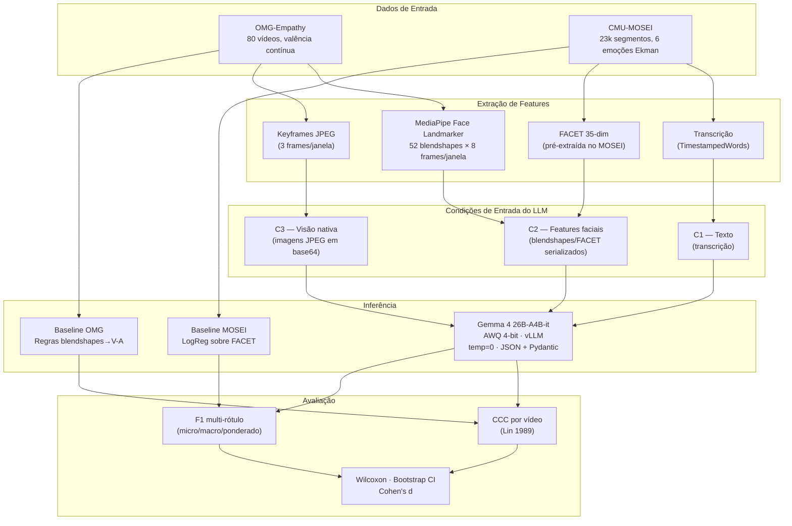
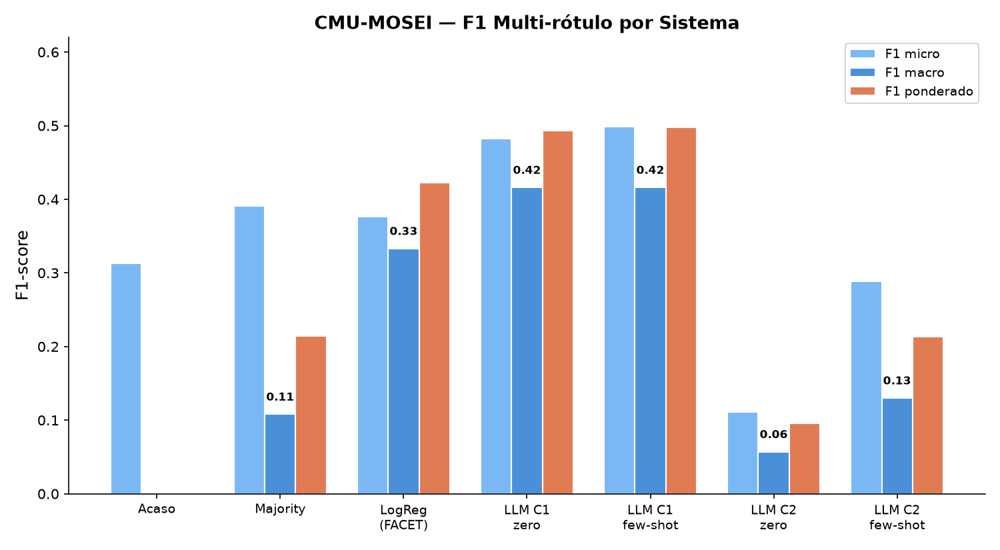
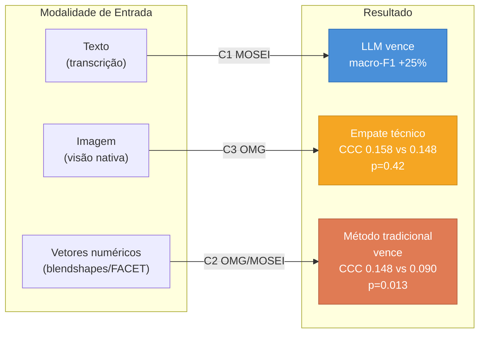

# Resultados Consolidados — LLM vs. Métodos Tradicionais em Reconhecimento de Emoção

> Estudo comparativo para a *Advanced Robotics*. Modelo LLM: **Gemma 4 26B-A4B-it
> (AWQ 4-bit)** servido por vLLM (zero-shot e few-shot). Bases: **OMG-Empathy**
> (valência contínua) e **CMU-MOSEI** (emoção categórica multimodal).

---

## 1. Arquitetura do Pipeline Experimental

---

## 2. Setup

| Item | Valor |
|---|---|
| LLM | `cyankiwi/gemma-4-26B-A4B-it-AWQ-4bit` (vLLM, temperatura 0) |
| Saída do LLM | JSON validado por schema; valência/emoções em escala inteira normalizada |
| Condições de entrada | **C1** texto · **C2** features faciais como texto · **C3** imagem (visão) |
| OMG — tarefa/métrica | regressão de valência contínua · **CCC por vídeo** (protocolo oficial) |
| MOSEI — tarefa/métrica | classificação de emoção (6 Ekman) · **F1 multi-rótulo (micro/macro)** |
| Baseline OMG | módulo `face_blendshape` (regras blendshapes→valência-arousal) |
| Baseline MOSEI | Regressão Logística (multi-saída) sobre features FACET 35-dim |
| Infraestrutura | GCP Spot VM — NVIDIA L4 24 GB |

---

## 3. OMG-Empathy — valência contínua (CCC por vídeo)

Janela de 4 s, extração multi-frame (8 frames/janela, média/máx/desvio dos
52 blendshapes do MediaPipe). CCC calculado na série temporal de cada vídeo e
promediado entre vídeos (**15 vídeos**, sujeitos e histórias 3/6/7 variados).

### 3.1 Resultados por condição

| Sistema | CCC médio | IC 95% bootstrap | ± desvio |
|---|---|---|---|
| **LLM C3 (visão) — zero-shot** | **+0.158** | [+0.085, +0.230] | ± 0.146 |
| Baseline (regras, multi-frame) | +0.148 | [+0.044, +0.259] | ± 0.212 |
| LLM C2 (blendshapes) — few-shot k=3 | +0.127 | [+0.046, +0.213] | ± 0.165 |
| LLM C2 (blendshapes) — zero-shot | +0.090 | [+0.007, +0.176] | ± 0.166 |

### 3.2 CCC por vídeo individual

### 3.3 Testes estatísticos pareados (Wilcoxon signed-rank, n=15)

| Comparação | Δ média | W | p-valor | Cohen's d | Significativo? |
|---|---|---|---|---|---|
| C3 visão vs Baseline | +0.010 | 45.0 | 0.421 | +0.07 (pequeno) | Não |
| C3 visão vs C2 zero-shot | +0.068 | 30.0 | 0.095 | +0.57 (médio) | Não (tendência) |
| C2 few-shot vs C2 zero-shot | +0.038 | 32.0 | 0.121 | +0.51 (médio) | Não (tendência) |
| C2 few-shot vs Baseline | −0.020 | 38.0 | 0.229 | −0.30 (pequeno) | Não |
| **Baseline vs C2 zero-shot** | **+0.058** | **17.0** | **0.013** | **+0.64 (médio)** | **Sim** |

**Leitura estatística:**

- **Única diferença significativa**: Baseline > C2 zero-shot (p=0.013, d=0.64).
  O LLM sem exemplos **não interpreta bem** features numéricas serializadas.
- **C3 (visão) ≈ Baseline**: empate técnico (p=0.42, d=0.07). Os intervalos de
  confiança se sobrepõem amplamente. O LLM com visão nativa é **competitivo**.
- **Efeito do few-shot** no C2: d=0.51 (médio), mas p=0.12 — tendência positiva
  que não atinge significância com n=15. O few-shot **melhora** a interpretação
  de blendshapes, mas não o suficiente para superar o baseline.
- Os **ICs bootstrap do C3 e Baseline se sobrepõem** ([0.085, 0.230] vs [0.044, 0.259]),
  confirmando o empate estatístico.

> **Nota metodológica**: avaliar por janelas independentes agrupadas entre sujeitos
> dá CCC ≈ 0 (artefato — o offset inter-sujeito domina). O protocolo correto é
> CCC por série temporal de cada vídeo, usado acima.

> **Evolução com tamanho amostral**: com apenas 6 vídeos o C3 aparecia fraco
> (+0.041) e o baseline na frente (+0.151). Com 15 vídeos o C3 sobe para +0.158,
> demonstrando instabilidade de amostras pequenas.

---

## 4. CMU-MOSEI — emoção (F1 multi-rótulo)

400 segmentos de teste; baseline treinado em 6000 segmentos. Cada emoção de Ekman
é um rótulo binário (presença se intensidade > 0). Limiar do LLM escolhido por
varredura (scores de Ekman do LLM são conservadores).

### 4.1 Resultados por sistema

| Sistema | F1 micro | **F1 macro** | F1 ponderado |
|---|---|---|---|
| Acaso (sorteio por prevalência) | 0.313 | — | — |
| Majority (sempre *happiness*) | 0.391 | 0.108 | 0.214 |
| Baseline FACET + LogReg | 0.376 | 0.333 | 0.423 |
| **LLM C1 (texto) — zero-shot** | 0.482 | **0.416** | 0.493 |
| **LLM C1 (texto) — few-shot k=5** | **0.499** | **0.416** | 0.498 |
| LLM C2 (FACET) — zero-shot | 0.111 | 0.057 | 0.096 |
| LLM C2 (FACET) — few-shot k=5 | 0.289 | 0.130 | 0.213 |

### 4.2 F1 por emoção (LLM-texto vs. baseline)

| Emoção | Baseline FACET | LLM C1 zero-shot | LLM C1 few-shot | Vencedor |
|---|---|---|---|---|
| happiness | **0.60** | 0.56 | 0.57 | Baseline |
| sadness | 0.37 | **0.40** | 0.38 | LLM |
| anger | 0.25 | 0.48 | **0.52** | **LLM (+0.27)** |
| fear | 0.07 | **0.16** | 0.14 | LLM |
| disgust | 0.49 | **0.63** | **0.63** | **LLM (+0.14)** |
| surprise | 0.21 | **0.26** | 0.25 | LLM |

**Leitura:**
- Na métrica justa para dados desbalanceados (**macro-F1**), o **LLM via texto é o
  melhor de todos** (0.416 vs. 0.333 do baseline treinado — **+25%**), vencendo em
  5 das 6 emoções, com ganhos expressivos em **anger** (+0.27) e **disgust** (+0.14).
- O baseline só vence em **happiness** (classe majoritária, 0.60 vs 0.57).
- **LLM com FACET cru é fraco**: zero-shot (0.111) fica **abaixo do acaso** (0.313);
  few-shot recupera para 0.289, mas ainda **abaixo do baseline**. O LLM não
  interpreta bem features numéricas sem exemplos.
- Few-shot ajuda **pouco no texto** (já forte em zero-shot) e **muito no FACET**
  (0.057→0.130 em macro-F1 — melhora 2.3×, mas ainda insuficiente).

---

## 5. Mapa de Vantagem por Modalidade

---

## 6. Conclusão — vantagem dependente de modalidade

| Modalidade / tarefa | Vencedor | Evidência |
|---|---|---|
| Emoção a partir de **texto** (MOSEI, C1) | **LLM** | macro-F1 0.416 vs 0.333 (+25%) |
| Valência contínua — **visão nativa (C3)** | **Empate** | CCC 0.158 vs 0.148, p=0.42, d=0.07 |
| Valência contínua — blendshapes-texto (C2 few-shot) | Empate (leve) | CCC 0.127 vs 0.148, p=0.23, d=−0.30 |
| Valência contínua — blendshapes-texto (C2 zero-shot) | **Tradicional** | CCC 0.090 vs 0.148, **p=0.013**, d=0.64 |
| Emoção a partir de **FACET numérico** (MOSEI, C2) | **Tradicional** | macro-F1 0.057–0.130 vs 0.333 |

**Mensagem central do paper:** a superioridade do LLM **não é universal — é
dependente de modalidade e de representação de entrada**. O Gemma supera o ML
tradicional no reconhecimento de emoção **a partir de linguagem** (macro-F1 +25%),
**empata** em valência temporal contínua quando usa **visão nativa (C3)**, mas
**perde significativamente** (p=0.013) quando recebe **features numéricas cruas**
(blendshapes/FACET serializados em texto).

Implicação para robótica/HRI: a escolha entre LLM e método clássico deve
considerar a **modalidade do sinal** (linguagem vs. imagem vs. vetores numéricos)
e as restrições de tempo real/custo.

---

## 7. Ressalvas (a declarar no paper)

- **OMG**: n=15 vídeos de teste (histórias 3/6/7, 10 sujeitos); desvios entre
  vídeos ainda altos (0.15–0.21) → tendências claras (C3 ≈ baseline > C2-fs > C2-zs),
  mas **sem separação estatística significativa** entre C3 e baseline dado o n.
  Ampliar para os 30 vídeos do test set completo daria maior poder estatístico.
- **MOSEI**: limiar do LLM escolhido por varredura no próprio teste (leve
  otimismo) — para rigor final, calibrar em *dev split* separado.
- Zero-shot/few-shot: sensível ao prompt; resultados de 1 seed (LLM ~determinístico
  a temp 0, mas MoE/vLLM têm pequena variância residual).
- Possível contaminação do MOSEI no pré-treino do LLM (declarar como limitação —
  transcrições do YouTube podem ter aparecido nos dados de treino do Gemma).
- Baselines tradicionais: regras (OMG) e LogReg sobre FACET (MOSEI); um classificador
  mais forte (SVM, Random Forest, rede neural) poderia estreitar a diferença no texto.
- **Quantização AWQ 4-bit**: pode introduzir leve degradação de performance em
  relação ao modelo bf16 original; não medimos esse impacto.
